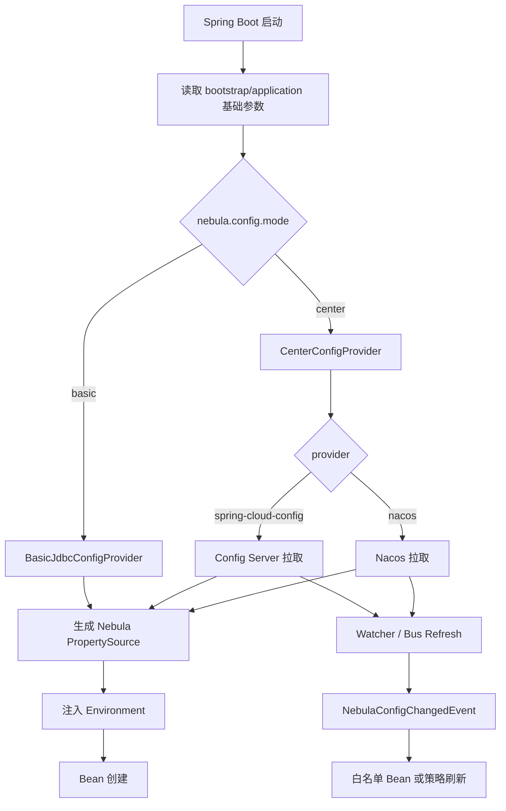

# Nebula 详细开发规划

> 最后更新：2026-07-24
>
> 本文承接 [nebula-current-state-analysis.md](./nebula-current-state-analysis.md) 与 [nebula/docs/development-plan.md](../nebula/docs/development-plan.md)，记录需要跨模块拆解的详细工程计划。

---

## 1. nebula-config 配置中心优化专项

### 1.1 背景结论

经文档与 `nebula/nebula-config` 代码核实，当前实现不能承担完整配置中心职责。它已有 `ConfigService`、内存/JDBC 仓库、`nebula_config` 表、变更事件和 CORS/CSP 运行时策略，但缺少 Spring 启动期配置导入、远端配置中心 provider、监听刷新、快照缓存、优先级合并和失败策略。

因此后续目标不是简单增强 CRUD，而是把 `nebula-config` 重构为“统一配置加载与刷新框架”，并支持两种部署模式。

### 1.2 目标模式

| 模式 | 配置项 | 数据来源 | 适用场景 | 关键要求 |
| ---- | ------ | -------- | -------- | -------- |
| 基础模式 | `nebula.config.mode=basic` | 架构指定数据源 + 指定配置表 | 单体、演示、轻量私有部署 | 启动期加载、可指定表/列映射、稳定覆盖 Spring Environment |
| 中心模式 | `nebula.config.mode=center` | Spring Cloud Config Server、Nacos 等 | 多应用、多环境、集中治理 | 启动期拉取、运行期监听、快照缓存、失败策略、健康检查 |

### 1.3 配置示例

基础模式：

```yaml
nebula:
  config:
    mode: basic
    basic:
      datasource-ref: platformDataSource
      table: nebula_config
      key-column: config_key
      value-column: config_value
      application-column: application_id
      tenant-column: tenant_id
      group-column: group_name
      profile: dev
      precedence: external
```

中心模式 — Spring Cloud Config Server：

```yaml
nebula:
  config:
    mode: center
    center:
      provider: spring-cloud-config
      application: nebula-platform
      profile: prod
      label: main
      uri: http://config-server:8888
      username: nebula
      password: ${NEBULA_CONFIG_PASSWORD}
      fail-strategy: use-snapshot
      watch:
        enabled: true
```

中心模式 — Nacos：

```yaml
nebula:
  config:
    mode: center
    center:
      provider: nacos
      server-addr: http://nacos:8848
      namespace: nebula-prod
      group: DEFAULT_GROUP
      data-id: nebula-platform.yaml
      username: nacos
      password: ${NACOS_PASSWORD}
      fail-strategy: use-snapshot
      watch:
        enabled: true
```

### 1.4 模块拆分

| 模块 | 职责 |
| ---- | ---- |
| `config-core` | 定义 `ConfigSource`、`ConfigProvider`、`ConfigSnapshot`、`ConfigWatcher`、`ConfigMergeStrategy`、统一异常与事件 |
| `config-storage` | 保留 `basic` JDBC/内存实现；新增表结构映射与启动期读取能力 |
| `config-center-api` | 定义配置中心 provider SPI，避免核心模块绑定具体厂商 SDK |
| `config-center-spring-cloud` | 适配 Spring Cloud Config Server |
| `config-center-nacos` | 适配 Nacos config |
| `config-runtime` | 负责运行期刷新、事件广播、refreshable 白名单、健康指标 |
| `config-autoconfigure` | 根据 `nebula.config.mode` 条件装配 basic/center |
| `config-starter` | 对应用暴露唯一 starter 入口 |

### 1.5 核心流程



### 1.6 分阶段计划

#### P1：抽象与 basic 模式启动期加载（✅ 2026-07-25）

- 新增 `NebulaConfigProperties`，明确 `mode/basic/center/fail-strategy/watch` 配置树。
- 新增 `NebulaConfigDataLocationResolver` 与 `NebulaConfigDataLoader`，或等价 `EnvironmentPostProcessor`，让 basic 模式在 Bean 创建前加载配置。
- 改造 `JdbcConfigRepository`：支持表名与列名映射；保留默认 `nebula_config`。
- 明确 property source 名称与优先级：`nebula-basic-config`。
- 验收：应用只配置数据源与 `nebula.config.mode=basic`，启动期配置可覆盖 `application.yml` 中的业务属性。

#### P2：中心模式 provider SPI 与 Spring Cloud Config Server（✅ 2026-07-25）

- 新增 `ConfigCenterProvider` SPI：`load(context)`、`watch(context, listener)`、`health()`。
- 实现 `spring-cloud-config` provider：支持 `uri/application/profile/label/username/password/timeout`。
- 增加本地快照缓存：启动成功后写入快照；远端不可用时按策略读取。
- 验收：Config Server 修改配置后，Nebula 应用可收到变更事件并刷新允许热刷的配置。

#### P3：Nacos provider（✅ 2026-07-25，采用无厂商 SDK 的版本轮询 watcher）

- 实现 Nacos provider：支持 `server-addr/namespace/group/data-id/username/password`。
- 接入 Nacos Listener；变更转换为统一 `NebulaConfigChangedEvent`。
- 支持 YAML/properties/JSON 解析。
- 验收：Nacos 发布配置后，应用无需重启即可刷新白名单配置。

#### P4：治理与兼容收口（✅ 2026-07-25）

- 把 `nebula-module-config` 定位为业务配置管理，不再与配置中心概念混用。
- 更新 `nebula/docs/system/config.md`、`development-status.md`、`implementation-backlog.md` 的“配置中心 REST”表述。
- 增加健康检查：当前模式、provider、最后加载时间、快照版本、watch 状态。
- 增加测试矩阵：basic JDBC、Config Server、Nacos、远端失败策略。

### 1.7 风险与约束

| 风险 | 说明 | 处理 |
| ---- | ---- | ---- |
| 启动期依赖数据源 | basic 模式需要先有最小数据源参数 | 只允许从 bootstrap/application/env 获取数据源连接参数，禁止再依赖 `nebula_config` 反向配置该数据源 |
| 热刷新边界过大 | 数据源、线程池、安全密钥等不宜无差别刷新 | 引入 refreshable 白名单与重启提示 |
| 厂商 SDK 侵入 | Nacos/Spring Cloud 依赖污染核心模块 | provider 独立模块 + SPI |
| 失败降级不透明 | 远端失败后悄悄使用旧配置会掩盖事故 | `fail-fast/use-snapshot/ignore` 三策略必须记录日志并暴露健康状态 |

---

## 2. 文档同步事项

- [x] `docs/nebula-current-state-analysis.md`：补充 `nebula-config` 专项诊断与双模式优化方向。
- [x] `nebula/docs/development-plan.md`：把配置中心优化纳入 W13，并新增 G8a/G8b/G8c 子关口。
- [x] `nebula/docs/implementation-backlog.md`：配置中心专项已落地并从 P1 backlog 移除，仅保留可选治理增强。
- [x] `nebula/docs/development-status.md`：区分业务配置 REST 与已完成的配置中心能力。
- [x] `nebula/docs/system/config.md`：区分 system-config、module-config、nebula-config 三者职责。
