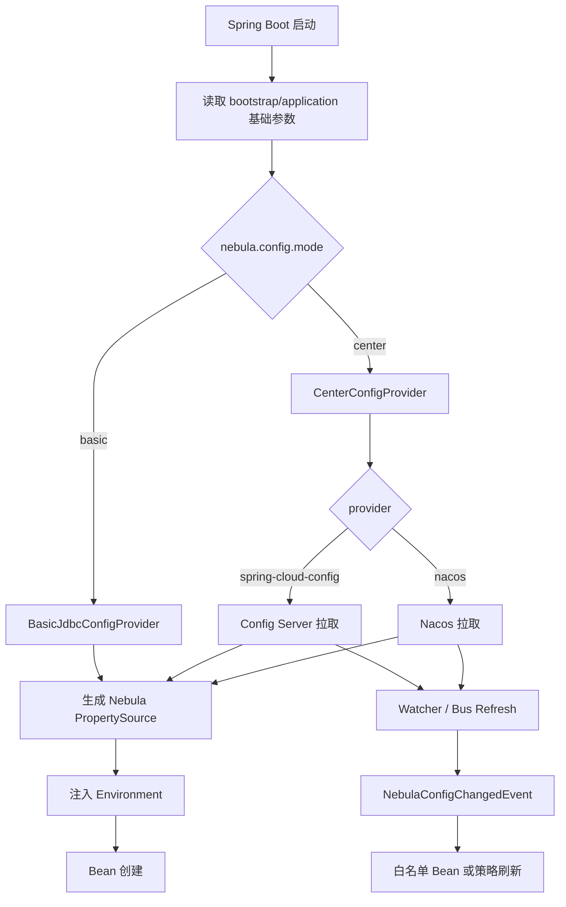
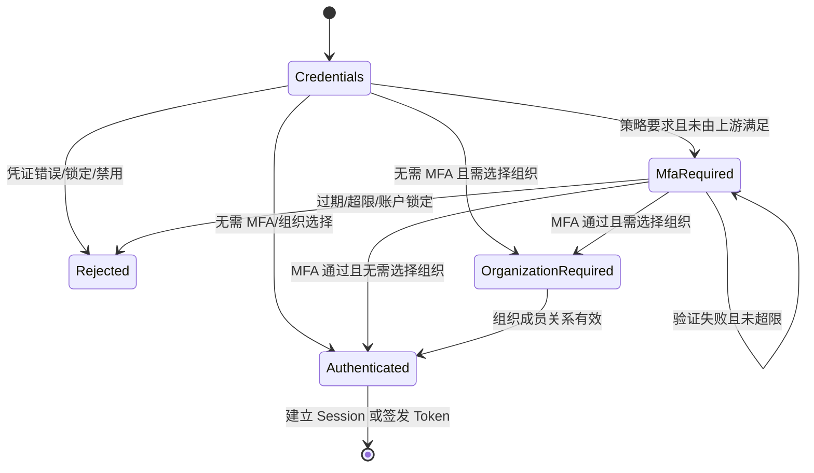
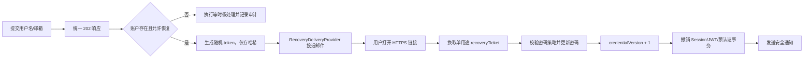

# Nebula 详细开发规划

> 最后更新：2026-07-26
>
> 本文承接 [nebula-current-state-analysis.md](./nebula-current-state-analysis.md)、
> [nebula/docs/development-plan.md](../nebula/docs/development-plan.md) 与
> [nebula-studio-frontend-refactoring-plan.md](./nebula-studio-frontend-refactoring-plan.md)，记录需要跨模块拆解的详细工程计划。

---

## 1. nebula-config 配置中心优化专项

### 1.1 背景结论

专项启动时，`nebula-config` 只有 `ConfigService`、内存/JDBC 仓库、
`nebula_config` 表、变更事件和 CORS/CSP 运行时策略，不能承担完整配置中心职责。
2026-07-25 已按本章 P1–P4 补齐启动期导入、center provider、监听/轮询刷新、
快照、优先级合并、失败策略和治理文档。

当前剩余问题不是配置中心能力缺失，而是应用组合验证不足：2026-07-26 的真实栈验收显示
`platform-console` 未能获得 `ConfigService` Bean。第 5.3–5.4 节将该 AutoConfiguration/
Starter 装配问题列为 P0 复验项。

### 1.2 目标模式

| 模式 | 配置项 | 数据来源 | 适用场景 | 关键要求 |
| ---- | ------ | -------- | -------- | -------- |
| 基础模式 | `nebula.config.mode=basic` | 架构指定数据源 + 指定配置表 | 单体、演示、轻量私有部署 | 启动期加载、可指定表/列映射、稳定覆盖 Spring Environment |
| 中心模式 | `nebula.config.mode=center` | Spring Cloud Config Server、Nacos 等 | 多应用、多环境、集中治理 | 启动期拉取、运行期监听、快照缓存、失败策略、健康检查 |

### 1.3 配置示例

基础模式：

```yaml
nebula:
  config:
    mode: basic
    basic:
      datasource-ref: platformDataSource
      table: nebula_config
      key-column: config_key
      value-column: config_value
      application-column: application_id
      tenant-column: tenant_id
      group-column: group_name
      profile: dev
      precedence: external
```

中心模式 — Spring Cloud Config Server：

```yaml
nebula:
  config:
    mode: center
    center:
      provider: spring-cloud-config
      application: nebula-platform
      profile: prod
      label: main
      uri: http://config-server:8888
      username: nebula
      password: ${NEBULA_CONFIG_PASSWORD}
      fail-strategy: use-snapshot
      watch:
        enabled: true
```

中心模式 — Nacos：

```yaml
nebula:
  config:
    mode: center
    center:
      provider: nacos
      server-addr: http://nacos:8848
      namespace: nebula-prod
      group: DEFAULT_GROUP
      data-id: nebula-platform.yaml
      username: nacos
      password: ${NACOS_PASSWORD}
      fail-strategy: use-snapshot
      watch:
        enabled: true
```

### 1.4 模块拆分

| 模块 | 职责 |
| ---- | ---- |
| `config-core` | 定义 `ConfigSource`、`ConfigProvider`、`ConfigSnapshot`、`ConfigWatcher`、`ConfigMergeStrategy`、统一异常与事件 |
| `config-storage` | 保留 `basic` JDBC/内存实现；新增表结构映射与启动期读取能力 |
| `config-center-api` | 定义配置中心 provider SPI，避免核心模块绑定具体厂商 SDK |
| `config-center-spring-cloud` | 适配 Spring Cloud Config Server |
| `config-center-nacos` | 适配 Nacos config |
| `config-runtime` | 负责运行期刷新、事件广播、refreshable 白名单、健康指标 |
| `config-autoconfigure` | 根据 `nebula.config.mode` 条件装配 basic/center |
| `config-starter` | 对应用暴露唯一 starter 入口 |

### 1.5 核心流程



### 1.6 分阶段计划

#### P1：抽象与 basic 模式启动期加载（✅ 2026-07-25）

- 新增 `NebulaConfigProperties`，明确 `mode/basic/center/fail-strategy/watch` 配置树。
- 新增 `NebulaConfigDataLocationResolver` 与 `NebulaConfigDataLoader`，或等价 `EnvironmentPostProcessor`，让 basic 模式在 Bean 创建前加载配置。
- 改造 `JdbcConfigRepository`：支持表名与列名映射；保留默认 `nebula_config`。
- 明确 property source 名称与优先级：`nebula-basic-config`。
- 验收：应用只配置数据源与 `nebula.config.mode=basic`，启动期配置可覆盖 `application.yml` 中的业务属性。

#### P2：中心模式 provider SPI 与 Spring Cloud Config Server（✅ 2026-07-25）

- 新增 `ConfigCenterProvider` SPI：`load(context)`、`watch(context, listener)`、`health()`。
- 实现 `spring-cloud-config` provider：支持 `uri/application/profile/label/username/password/timeout`。
- 增加本地快照缓存：启动成功后写入快照；远端不可用时按策略读取。
- 验收：Config Server 修改配置后，Nebula 应用可收到变更事件并刷新允许热刷的配置。

#### P3：Nacos provider（✅ 2026-07-25，采用无厂商 SDK 的版本轮询 watcher）

- 实现 Nacos provider：支持 `server-addr/namespace/group/data-id/username/password`。
- 接入 Nacos Listener；变更转换为统一 `NebulaConfigChangedEvent`。
- 支持 YAML/properties/JSON 解析。
- 验收：Nacos 发布配置后，应用无需重启即可刷新白名单配置。

#### P4：治理与兼容收口（✅ 2026-07-25）

- 把 `nebula-module-config` 定位为业务配置管理，不再与配置中心概念混用。
- 更新 `nebula/docs/system/config.md`、`development-status.md`、`implementation-backlog.md` 的“配置中心 REST”表述。
- 增加健康检查：当前模式、provider、最后加载时间、快照版本、watch 状态。
- 增加测试矩阵：basic JDBC、Config Server、Nacos、远端失败策略。

### 1.7 风险与约束

| 风险 | 说明 | 处理 |
| ---- | ---- | ---- |
| 启动期依赖数据源 | basic 模式需要先有最小数据源参数 | 只允许从 bootstrap/application/env 获取数据源连接参数，禁止再依赖 `nebula_config` 反向配置该数据源 |
| 热刷新边界过大 | 数据源、线程池、安全密钥等不宜无差别刷新 | 引入 refreshable 白名单与重启提示 |
| 厂商 SDK 侵入 | Nacos/Spring Cloud 依赖污染核心模块 | provider 独立模块 + SPI |
| 失败降级不透明 | 远端失败后悄悄使用旧配置会掩盖事故 | `fail-fast/use-snapshot/ignore` 三策略必须记录日志并暴露健康状态 |

---

## 2. 文档同步事项

- [x] `docs/nebula-current-state-analysis.md`：补充 `nebula-config` 专项诊断与双模式优化方向。
- [x] `nebula/docs/development-plan.md`：把配置中心优化纳入 W13，并新增 G8a/G8b/G8c 子关口。
- [x] `nebula/docs/implementation-backlog.md`：配置中心专项已落地并从 P1 backlog 移除，仅保留可选治理增强。
- [x] `nebula/docs/development-status.md`：区分业务配置 REST 与已完成的配置中心能力。
- [x] `nebula/docs/system/config.md`：区分 system-config、module-config、nebula-config 三者职责。

---

## 3. nebula-plugin 与 Camel 插件重构专项

### 3.1 完成项（2026-07-26）

- [x] 以 `SpringBootPluginManager` + PF4J 作为唯一生产加载链路，移除未被生产模块引用的 `nebula-plugin-spi/runtime/manager/loader` 第二套状态机。
- [x] 仓库模型统一为 `NebulaPluginDescriptor`，`nebula-plugin-repository` 不再依赖旧 SPI。
- [x] Maven 仓库使用真实 HTTP/JAR 下载，支持版本元数据、搜索、SHA-256、制品格式校验和同版本冲突检测。
- [x] 本地仓库对 Maven 坐标进行安全编码，阻止目录穿越，并支持重启后重建索引。
- [x] `nebula-camel-plugin-api` 只依赖稳定 `nebula-plugin-sdk`，不再向插件开发者泄漏 `plugin-core` 内核上下文。
- [x] 平台/Camel descriptor 在插件启动前校验 schema、身份、版本、领域入口、Connector 唯一性以及声明与 PF4J 发现结果的一致性。
- [x] Executor 插件加载改为失败回滚；下载文件名限制在插件目录内；旧版本完成过渡时真实卸载；租户+状态查询条件已修正。
- [x] MySQL/PostgreSQL/HTTP 内置插件声明 `capabilities` 与 `domainDescriptors.camel`。

### 3.2 后续可选治理

- 插件制品签名、可信供应商证书与密钥轮换。
- 解析 `compatibility` 与 `dependencies` 的语义化版本约束并在安装前求解。
- 为 Nexus/Artifactory 等私有仓库提供专用搜索适配器。
- 前端插件市场消费 descriptor 的 `configSchema` / `nodeSchema`，形成低代码目录。

---

## 4. 认证安全：MFA 与自助恢复专项

### 4.1 当前基线与问题

2026-07-26 对后端实现核实后的基线如下：

- `AuthRestController` 当前提供 `/api/auth/login`、`/login/complete`、`/switch-org`、`/me` 和 `/mode`。
- `DefaultAuthenticationFacade` 同时编排 token/session 登录与组织选择；密码校验成功后会立即建立
  Session 或签发 JWT。
- `nebula_user` 已包含用户名、BCrypt 密码、邮箱、手机号和 `ACTIVE/INACTIVE/LOCKED` 状态，但没有
  MFA 因子、恢复凭证、认证事务、失败计数、临时锁定时间或凭证版本。
- 管理端已有强制重置密码能力，但没有面向用户的自助恢复流程。
- 登录日志能够记录成功/失败，但不能代替认证挑战状态、一次性凭证和风险状态存储。
- 前端 AuthFlow 已具备账号、组织、MFA、恢复、成功和分类失败状态；后端尚未提供 MFA 与恢复契约，
  前端因此不会伪造验证成功。

主要风险：

1. 在 MFA 或组织选择完成前签发可用 JWT，会让后续步骤成为界面流程而非真正的认证关口。
2. 直接使用 HTTP Session 保存“密码已通过”状态会造成 Web、Electron、token/session 模式语义分叉。
3. 恢复接口若暴露“用户不存在、邮箱未绑定”等差异，会形成账号枚举渠道。
4. TOTP secret、恢复码和邮件链接若以明文保存，数据库泄漏会直接绕过第二因素。
5. 密码重置后若不能统一撤销旧 Session/JWT，失窃会话仍然有效。

### 4.2 目标与边界

目标：

- 建立与 token/session 模式无关的 `AuthTransaction` 预认证状态机。
- 首期支持 TOTP；预留 WebAuthn/Passkey 因子扩展，不在首期自建短信验证码通道。
- 提供邮箱链接驱动的密码自助恢复，以及 MFA 恢复码驱动的第二因素恢复。
- 所有必需步骤完成后才建立 SecurityContext、Session 或签发 JWT。
- 密码重置、MFA 关闭、账户锁定和管理员撤权能够撤销已有会话。
- 使用稳定错误码、OpenAPI DTO 和统一审计事件对接前端 AuthFlow。

非目标：

- 不把 OAuth2/OIDC 上游身份提供商的 MFA 再复制到 Nebula；上游已满足认证强度时消费其 `amr/acr`
  声明。
- 不通过安全问题进行找回。
- 不在数据库中保存 TOTP secret、恢复码、邮件 token 或密码的明文。
- 不允许管理员查看用户的 TOTP secret 或已有恢复码。

### 4.3 认证状态机



关键约束：

- `AuthTransaction` 是短时、单次、服务端状态；客户端只持有高熵 `transactionId`，不能从中读取用户、
  MFA secret 或组织授权。
- 密码验证成功只把事务推进到 `PRIMARY_VERIFIED`，不得写入已认证 SecurityContext。
- 组织选择必须发生在 MFA 之后；组织确认完成前也不得签发最终访问令牌。
- 每次状态推进使用乐观锁或原子 compare-and-set，防止同一事务重复完成。
- 事务默认 5 分钟过期；完成、取消、超限或密码变化后立即失效。
- 最终 Session/JWT 写入 `amr`（如 `pwd`、`totp`、`webauthn`）、`auth_time`、组织上下文和
  `credentialVersion`。

### 4.4 模块与职责拆分

| 模块 | 新增/调整职责 |
| ---- | ------------- |
| `security-core` | 定义 `AuthenticationStep`、`AuthenticationAssurance`、稳定错误码和因子类型，不依赖 Web/数据库 |
| `nebula-security-auth-flow`（新增） | 编排 `AuthTransaction`、凭证校验、MFA、组织选择和最终会话签发 |
| `nebula-security-mfa`（新增） | `MfaFactorProvider` SPI、TOTP、恢复码、因子管理和验证限流 |
| `nebula-security-recovery`（新增） | 账户恢复事务、投递 provider、密码策略校验和全会话撤销 |
| `nebula-security-token` | 延迟到认证完成后签发 JWT；加入 `amr/auth_time/credentialVersion` 并校验撤销版本 |
| `nebula-security-session` | 认证完成前不持久化 LoginUser；完成后记录认证强度和凭证版本 |
| `nebula-security-web` | 提供类型化认证 DTO、REST 适配、统一异常映射与安全响应头 |
| `security-starter` | 按配置装配 auth-flow/MFA/recovery，并校验密钥、投递 provider 和生产环境安全配置 |
| `nebula-system-user` | 提供用户邮箱、状态、密码更新和 `credentialVersion` 端口，不保存 MFA secret |
| `capability-log` | 记录认证步骤、因子变更、恢复和会话撤销审计事件；禁止记录 secret、验证码和完整 token |

迁移策略：

- 短期扩展现有 `AuthenticationFacade`，保持 Camel Console/Platform Console 只有一个登录实现。
- 中期把通用 `/api/auth/**` 控制器移入 `nebula-security-web`；Camel Console 只保留兼容适配，
  不再拥有平台通用认证业务。
- `Map<String, Object>` 响应迁移为 OpenAPI 可生成的显式 DTO；兼容期保留
  `needsOrgSelection`，新前端以 `nextStep` 为准。

### 4.5 API 契约

#### 4.5.1 登录与 MFA 挑战

`POST /api/auth/login`

```json
{
  "username": "demo",
  "password": "******",
  "client": {
    "type": "WEB",
    "deviceName": "Chrome on Windows"
  }
}
```

响应不再保证立即返回 token，而是统一返回下一步：

```json
{
  "transactionId": "opaque-high-entropy-id",
  "nextStep": "MFA_REQUIRED",
  "expiresAt": "2026-07-26T12:05:00Z",
  "mfa": {
    "methods": ["TOTP", "RECOVERY_CODE"],
    "maskedDestination": null
  }
}
```

`nextStep` 取值：

- `MFA_REQUIRED`
- `ORGANIZATION_REQUIRED`
- `AUTHENTICATED`

其他接口：

| 方法与路径 | 用途 | 关键约束 |
| ---------- | ---- | -------- |
| `POST /api/auth/mfa/verify` | 使用 TOTP 或恢复码推进登录事务 | 通用失败响应；按事务、用户、IP 三维限流 |
| `POST /api/auth/login/complete` | 选择组织并完成认证 | 接收 `transactionId + orgId`，不依赖已认证上下文 |
| `POST /api/auth/transaction/cancel` | 主动取消预认证事务 | 幂等；不暴露事务是否已完成 |
| `GET /api/auth/me` | 返回当前用户、组织和认证强度 | 增加 `amr/authTime/mfaEnrolled` |

认证完成响应继续返回现有用户、角色、组织和 token/session 信息，保证 Web 与 Electron 共用同一契约。
Session 模式通过安全、HttpOnly、SameSite Cookie 建立会话；token 模式只在最终步骤返回访问令牌。

稳定错误码：

| HTTP | `code` | 前端状态/动作 |
| ---- | ------ | ------------- |
| 400 | `AUTH_TRANSACTION_INVALID` | 返回账号步骤 |
| 401 | `INVALID_CREDENTIALS` | 清空密码并重试 |
| 401 | `MFA_CODE_INVALID` | 保留 MFA 步骤并提示剩余尝试 |
| 401 | `MFA_REQUIRED` | 进入 MFA 步骤 |
| 403 | `ACCOUNT_DISABLED` | 使用其他账户/联系管理员 |
| 423 | `ACCOUNT_LOCKED` | 显示锁定说明和可恢复时间 |
| 429 | `AUTH_RATE_LIMITED` | 显示 `retryAfter`，禁止立即重试 |
| 503 | `AUTH_SERVICE_UNAVAILABLE` | 保留上下文并稍后重试 |

响应不得用不同状态或文案区分“用户名不存在”和“密码错误”。

#### 4.5.2 MFA 因子管理

以下接口要求已登录，并要求最近 5 分钟内完成密码或 MFA 再认证：

| 方法与路径 | 用途 |
| ---------- | ---- |
| `GET /api/auth/mfa` | 查询已启用因子、恢复码剩余数量和策略要求 |
| `POST /api/auth/mfa/totp/enrollment` | 创建待确认 TOTP secret，返回 `otpauth` URI/二维码数据 |
| `POST /api/auth/mfa/totp/confirm` | 验证首个 TOTP 后启用因子，并一次性返回恢复码 |
| `DELETE /api/auth/mfa/totp` | 关闭 TOTP；组织策略强制 MFA 时拒绝 |
| `POST /api/auth/mfa/recovery-codes/rotate` | 使旧恢复码全部失效并生成新码，仅显示一次 |
| `POST /api/auth/reauth` | 为敏感操作签发短时 `reauthTicket` |

TOTP 基线：

- RFC 6238、SHA-1 兼容主流认证器、6 位、30 秒步长，验证窗口默认前后各 1 个时间片。
- 防止同一时间片验证码重放，记录 `lastAcceptedTimeStep`。
- secret 使用独立主密钥进行信封加密；密钥来自环境/KMS，不进入数据库或普通配置快照。
- 恢复码至少 10 个、每个不少于 128 bit 随机熵的等价强度；只保存带独立 salt 的哈希。
- 因子启用、关闭、恢复码轮换后递增 `credentialVersion`，并通知或撤销其他会话。

WebAuthn/Passkey 在第二阶段通过 `MfaFactorProvider` 增量接入，不改变 AuthFlow 状态机。

#### 4.5.3 密码自助恢复

| 方法与路径 | 用途 | 对外响应 |
| ---------- | ---- | -------- |
| `POST /api/auth/recovery/start` | 按用户名或邮箱发起恢复 | 始终返回 `202 Accepted` 和相同通用文案 |
| `POST /api/auth/recovery/verify` | 验证邮件链接中的一次性 token | 成功后返回短时、单用途 `recoveryTicket` |
| `POST /api/auth/recovery/complete` | 提交 `recoveryTicket + newPassword` | 更新密码、递增凭证版本、撤销全部会话 |

恢复流程：



安全约束：

- 恢复 token 至少 256 bit 随机熵、10–15 分钟过期、单次使用，只保存哈希和 token 前缀用于定位。
- 链接 token 不写入访问日志、Referer、分析系统或前端持久存储；页面设置 `Referrer-Policy: no-referrer`。
- `/recovery/start` 按 IP、账号摘要和设备指纹限流，存在与不存在账号走近似等时路径。
- 新密码必须通过统一 `PasswordPolicy`，禁止与当前密码相同；可选接入泄漏密码库 provider。
- 完成恢复后不自动登录，用户必须使用新密码重新认证；强制撤销所有旧会话与未完成认证事务。
- 邮件投递使用 `RecoveryDeliveryProvider` SPI；开发环境允许日志/内存 provider，生产环境启动时禁止该 provider。
- 邮箱未验证、外部 IdP 托管账户或管理员禁止自助恢复时，仍返回统一响应并引导线下支持流程。

“遗失 MFA”与“忘记密码”是两条流程：已知密码但丢失 TOTP 时使用一次性恢复码；恢复码也丢失时进入
管理员审核流程，不允许仅凭密码关闭强制 MFA。

### 4.6 数据模型与迁移

建议新增独立 migration，不把认证临时数据塞入 `nebula_user`：

| 表 | 关键字段 | 说明 |
| -- | -------- | ---- |
| `nebula_auth_transaction` | `id_hash/user_id/state/required_steps/verified_steps/expires_at/attempts/version/client_context` | 短时预认证事务；定期清理 |
| `nebula_user_mfa_factor` | `id/user_id/type/secret_cipher/key_version/status/last_accepted_step/created_at/confirmed_at` | MFA 因子；secret 加密 |
| `nebula_mfa_recovery_code` | `factor_id/code_hash/used_at/created_at` | 单次恢复码；只存哈希 |
| `nebula_account_recovery` | `id/token_hash/user_id/status/expires_at/verified_at/consumed_at/request_context` | 密码恢复事务 |
| `nebula_auth_risk_state` | `user_id/failed_attempts/window_started_at/locked_until/version` | 临时锁定和失败窗口 |
| `nebula_security_audit` | `event_id/event_type/user_id/outcome/ip_hash/user_agent_hash/context/created_at` | 认证专用结构化审计，可适配现有日志能力 |

`nebula_user` 增加：

- `credential_version BIGINT NOT NULL DEFAULT 0`
- `password_changed_at TIMESTAMP`
- `email_verified_at TIMESTAMP`

所有表必须包含租户/组织作用域需要的字段或明确标记为平台级；用户认证身份是平台级，组织策略决定是否
要求 MFA，但因子不能按组织重复保存。数据库约束需保证每个用户每种单实例因子的唯一性，并为
`expires_at/status/user_id` 建立清理和查询索引。

存储实现：

- 首期提供 JDBC/PostgreSQL 实现。
- `AuthTransactionStore` 与限流器定义 SPI，可选 Redis 实现支持多实例原子计数和短 TTL。
- 单机内存 store 只允许测试/开发；生产环境多实例部署时启动检查必须拒绝内存实现。

### 4.7 策略配置

```yaml
nebula:
  security:
    authentication:
      transaction-ttl: 5m
      max-primary-attempts: 5
      lock-duration: 15m
    mfa:
      enabled: true
      policy: optional # optional / role-based / required
      required-roles:
        - PLATFORM_ADMIN
        - ORG_ADMIN
      totp:
        issuer: Nebula
        period: 30s
        digits: 6
        allowed-drift-steps: 1
      recovery-codes:
        count: 10
    recovery:
      enabled: true
      token-ttl: 15m
      delivery-provider: mail
      base-url: https://studio.example.com/auth/recovery
    session:
      revoke-on-password-change: true
      revoke-on-mfa-change: true
```

生产环境启动校验：

- MFA 开启时必须配置可用的 secret encryption key/KMS。
- 自助恢复开启时必须配置 HTTPS `base-url` 和生产级投递 provider。
- `required`/`role-based` 策略启用前，必须至少存在一个可用因子 provider。
- 配置中的密钥、SMTP 凭证不得由普通配置查询接口返回或写入诊断日志。

### 4.8 审计、限流与可观测性

统一事件：

- `AUTH_PRIMARY_SUCCEEDED/FAILED`
- `AUTH_MFA_CHALLENGED/SUCCEEDED/FAILED`
- `AUTH_TRANSACTION_EXPIRED/COMPLETED`
- `MFA_FACTOR_ENROLLED/DISABLED`
- `MFA_RECOVERY_CODE_USED/ROTATED`
- `ACCOUNT_RECOVERY_REQUESTED/COMPLETED`
- `ACCOUNT_LOCKED/UNLOCKED`
- `AUTH_SESSIONS_REVOKED`

指标：

- 登录、MFA、恢复各步骤成功率与 P95 延迟。
- 无效/过期事务数、验证码失败率、账号锁定数、限流拒绝数。
- 恢复邮件投递成功率与延迟。
- 凭证变化后 Session/JWT 撤销传播延迟。

日志仅记录事件 ID、用户内部 ID、结果和脱敏上下文；不得记录密码、TOTP、恢复码、secret、邮件 token、
完整 JWT、完整邮箱或手机号。告警需要区分攻击流量、投递 provider 故障和正常用户误操作。

### 4.9 分阶段计划

#### P1：契约、状态机与数据基线（P0）

- [ ] 定义 AuthFlow DTO、稳定错误码、`AuthTransaction` 状态机和 OpenAPI。
- [ ] 新增数据库 migration、JDBC store、定期清理任务和凭证版本。
- [ ] 改造登录流程：任何未完成步骤都不签发 token、不建立认证 Session。
- [ ] 保持 token/session 双模式和组织选择兼容测试。
- [ ] 前端切换为消费 `nextStep/code/transactionId`，删除基于错误文案识别 MFA 的临时逻辑。

验收：

- 抓取 MFA/组织选择前的所有响应均无法访问受保护 API。
- 同一事务并发完成时最多一次成功。
- 过期、取消、密码变化后的事务不可继续。

#### P2：TOTP、恢复码与策略（P0）

- [ ] 实现 TOTP provider、secret 加密、时间片防重放和验证限流。
- [ ] 实现因子注册/确认/关闭、恢复码生成/消费/轮换和再认证 ticket。
- [ ] 接入角色/组织 MFA 策略，管理员角色先灰度强制。
- [ ] 因子变化触发凭证版本递增、会话撤销和安全通知。

验收：

- 与至少两种主流认证器互通。
- 时间漂移、重复验证码、暴力尝试、恢复码重复使用均有自动化测试。
- 强制 MFA 用户不能绕过注册，也不能在无恢复证明时关闭最后一个因子。

#### P3：密码自助恢复与全会话撤销（P0）

- [ ] 实现恢复 start/verify/complete、通用响应、等时假处理和限流。
- [ ] 建立 `RecoveryDeliveryProvider`，交付邮件 provider 与开发环境内存 provider。
- [ ] 接入密码策略、凭证版本、Session 销毁、JWT 撤销检查和安全通知。
- [ ] 增加管理员审核型 MFA 丢失流程，只允许受控角色处理并全量审计。

验收：

- 存在/不存在账号的外部响应、状态码和可观察耗时无显著差异。
- 恢复 token 单次、过期和并发消费测试通过。
- 密码恢复后，旧 Web/Electron Session、JWT 和预认证事务均不可继续使用。

#### P4：WebAuthn、风险增强与治理（P1）

- [ ] 通过 `MfaFactorProvider` 增加 WebAuthn/Passkey。
- [ ] 消费上游 OIDC `amr/acr`，避免重复 MFA。
- [ ] 对高风险登录和敏感操作支持 step-up authentication。
- [ ] 建立用户安全中心、管理员策略页、恢复率/锁定率看板和应急 runbook。

P4 不阻塞 TOTP 和密码恢复上线。

### 4.10 测试矩阵与发布门禁

| 维度 | 必测场景 |
| ---- | -------- |
| 认证模式 | JWT、HTTP Session、上游 OIDC |
| 客户端 | Web、Electron、移动窄屏；同一 AuthFlow 契约 |
| 登录路径 | 无 MFA、MFA、组织选择、MFA + 组织选择 |
| 因子 | TOTP 正常/漂移/重放/超限，恢复码正常/重复 |
| 恢复 | 不存在用户、未验证邮箱、过期 token、并发完成、弱密码 |
| 撤销 | 密码变化、MFA 变化、锁定、管理员撤权、组织权限变化 |
| 部署 | 单实例 JDBC、多实例 Redis、时钟偏差、投递 provider 故障 |
| 安全 | 账号枚举、暴力破解、CSRF、重放、会话固定、开放重定向、敏感日志 |

发布门禁：

- 单元测试覆盖状态机、TOTP、密码策略、哈希/加密边界。
- Testcontainers 覆盖 PostgreSQL migration、事务并发与恢复 token 单次消费。
- Mock E2E 覆盖所有前端状态；real-stack E2E 覆盖 Web/Electron 登录、MFA、组织和恢复闭环。
- 安全测试确认未完成认证事务不能换取访问令牌，且恢复完成后旧会话立即失效。
- OpenAPI 生成后前后端无手写重复 DTO，错误码与前端映射测试同步通过。

### 4.11 上线顺序与回滚

1. 先上线数据表、DTO 和兼容读取，MFA/recovery 默认关闭。
2. 上线 AuthTransaction，但仅对测试租户启用；验证 token/session 和组织选择。
3. 开放用户自愿绑定 TOTP，不强制。
4. 对平台管理员灰度强制 MFA，再扩展到组织策略。
5. 邮件 provider、限流和全会话撤销验证通过后开放自助恢复。
6. 观察错误率、锁定率、恢复投递率和支持工单，再决定扩大范围。

回滚只能关闭“强制策略”和新入口，不得回滚或导出已生成 secret。已启用 MFA 的用户在兼容窗口内仍按
高认证强度处理；数据库 migration 采用向前兼容方式保留，恢复 token 和认证事务可安全失效。

---

## 5. 前端 Phase 8 与真实栈验收收口

### 5.1 已完成能力（2026-07-26）

- Playwright 已拆分为 `mock-regression`、`experience`、`real-stack` 和
  `electron` 四个 project，共枚举 24 项测试。
- Mock 12 项、体验/性能 10 项和 Electron 1 项已在本地通过；Shell 核心包
  13 项单测、前端 lint、PowerShell 脚本语法和生成契约无漂移检查通过。
- Shell/Login/Portal/Admin/Settings/Docs 已建立亮暗主题和
  320/768/1280/1440 px 共 48 张 Windows 视觉基线；键盘焦点和横向溢出进入自动断言。
- Web 资源目录/详情和 Electron 目录已建立首屏性能预算，并把测量结果写入
  Playwright JSON attachment。
- Electron 覆盖应用启动、认证会话恢复、Preload capability、Shell 窗口切换和
  Portal 亮暗主题截图。
- CI 分离 Mock、Windows 体验、Windows Electron 和手动/定时 real-stack 作业；
  失败时上传 Playwright trace、截图、录像与三项后端服务日志。

### 5.2 真实栈脚本行为

`nebula-studio/scripts/e2e/run-real-stack.ps1`：

1. 从相邻 `nebula` 仓库或显式 `-BackendRoot` 定位后端；
2. 通过 Maven reactor 安装 Platform Console、Camel Console、Executor 及其依赖；
3. 启动 `:8090/:8080/:8081`，逐服务健康检查，并在进程提前退出时立即失败；
4. 执行窗口配置生成、在线 OpenAPI 契约生成和 `git diff --exit-code`；
5. 运行无网络 Mock 的 `real-stack` Playwright project；
6. 只清理脚本自己启动的进程树，保留分类诊断日志。

### 5.3 当前后端阻塞

2026-07-26 已实际执行真实栈。PostgreSQL
`localhost:54321/postgres?currentSchema=nebula_studio` 可连接，目标 reactor
构建成功；`platform-console` 随后在 Spring 上下文初始化阶段失败：

```text
ConfigRestController
  -> required ConfigService
  -> no qualifying ConfigService bean
```

这说明 `config-core` 中已有接口/实现并不等于 Platform Console 已正确消费
`config-autoconfigure` 的默认装配。真实栈在该阶段停止是正确关口行为，不能通过
跳过 Platform Console 或退回 Mock 规避。

### 5.4 后端修复与复验清单（P0）

- [ ] 为 `platform-console` 增加 ApplicationContext 冒烟测试，断言
  `ConfigService`、配置仓库和 `ConfigRestController` 可同时创建。
- [ ] 检查 `config-starter` 依赖、AutoConfiguration imports、
  `@ConditionalOnMissingBean` 条件和 mode/profile 属性，确保
  `DefaultConfigService` 在 Platform Console 默认配置下装配。
- [ ] 为 demo-camel-console 和 demo-camel-executor 增加同类上下文测试，
  防止 `ClusterNodeReadMapper`、`ReleaseService` 等依赖再次因模块组合漂移而缺失。
- [ ] 三项服务健康检查通过后运行 `vp run test:e2e:real`。
- [ ] 确认在线契约生成无未提交差异，并完成登录、工作台、搜索、插件、订阅、
  Settings 权限、帮助、Gateway 和 Monitor 真实断言。
- [ ] 将真实栈 CI 从“能准确失败”提升为连续稳定通过后，才关闭 Phase 8 最终验收项。
