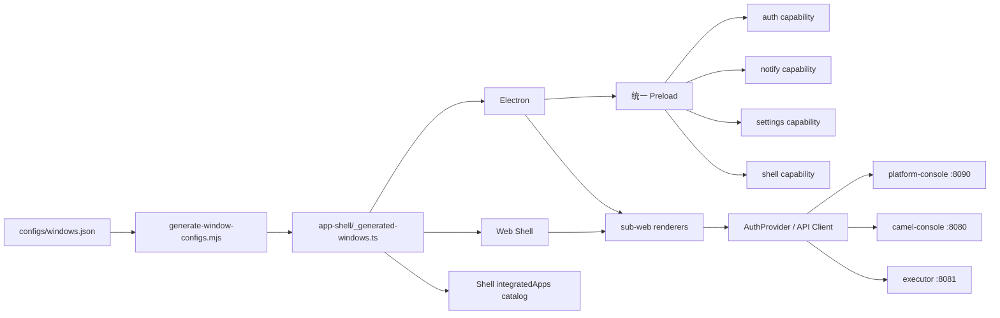

# Nebula Studio 前端架构现状与增量重构计划

> 文档版本：v2.2
>
> 最后更新：2026-07-26
>
> 代码基线：`F:\nebula-workspace\nebula-studio`
>
> 关联文档：[Nebula 当前状态分析](./nebula-current-state-analysis.md)、[Nebula 详细开发规划](./nebula-development-detailed-plan.md)

## 1. 文档目的

本文基于当前 `nebula-studio` 代码重新校准前端重构计划。旧版方案形成于
2026-06-25，其中多项“目标能力”已经落地，部分目录迁移建议也已失去必要性。

本次修订遵循以下原则：

1. 以当前代码为事实来源，不沿用旧路径和旧完成度。
2. 保留已经稳定的 `apps/sub-web/*` 结构，不进行纯命名型大迁移。
3. 优先消除真实重复源、契约漂移和运行时分叉。
4. 新增业务能力前先完成共享层和验收边界。
5. Web 与 Electron 必须复用同一份窗口、认证和 API 契约。
6. 用户门户按用户任务设计，管理后台按治理职责设计，不用同一套信息架构兼顾两类场景。

---

## 2. 当前架构基线

### 2.1 仓库结构

```text
nebula-studio/
├── apps/
│   ├── electron/                 # Electron 主进程和 renderer 构建入口
│   ├── electron-preload/src/     # 统一 Preload 实现
│   ├── web/                      # Web Shell
│   └── sub-web/
│       ├── frontend/             # Shell 主界面
│       ├── integration/          # 集成、插件、任务、治理、监控
│       ├── settings/             # 用户、组织、权限、配置
│       ├── login/                # 登录
│       └── docs/                 # UI/使用文档
├── configs/
│   ├── windows.json              # 窗口、Renderer、API 基址单源配置
│   └── windows.schema.json       # 配置 Schema
├── packages/
│   ├── contracts/                # 手写契约 + OpenAPI 生成结果
│   ├── core/
│   │   ├── api-client/
│   │   ├── app-shell/
│   │   ├── auth/
│   │   ├── auth-provider/
│   │   ├── electron-shared/
│   │   ├── msw/
│   │   ├── runtime/
│   │   ├── shell/
│   │   ├── sse-events/
│   │   └── tenant/
│   ├── ui/
│   ├── editors/
│   └── features/
│       └── use-confirm/
├── internal/vite/                # Vite+/Electron/Vite 配置封装
├── scripts/
│   ├── generate-window-configs.mjs
│   └── generate-contracts.mjs
└── e2e/                          # Playwright 冒烟与关键路径测试
```

### 2.2 当前运行模型



### 2.3 完成度矩阵

| 能力 | 当前状态 | 代码事实 | 结论 |
| --- | --- | --- | --- |
| 窗口配置集中化 | 基本完成 | `configs/windows.json` + JSON Schema + 生成脚本 | 保留并继续收口 |
| App Shell 分层 | 已完成 | `core/app-shell` 与 `core/shell` 已拆分 | 不再迁移目录 |
| 统一认证 | 已完成 | `auth-provider` 为 Session 单一写入入口 | 后续补跨应用一致性测试 |
| 统一 Preload | 已完成 | manifest capability map + `unified.ts` + capability 工厂 | 保持单源 |
| Web/Electron 配置复用 | 已完成 | 两端均消费内部 Vite manifest/config | Embed 入口继续执行存在性校验 |
| API Client | 已完成基础层 | `core/api-client` 已有鉴权、响应解析和测试 | 需全面消费生成契约 |
| OpenAPI 生成 | Phase 1 完成 | generated facade + Auth/Plugin 域迁移 | 继续迁移 Integration/System |
| Integration 功能 | 功能较全但过载 | 插件、任务、服务治理、订阅、监控集中于单应用 | 需要按 feature 边界拆分 |
| Features 共享包 | 未按旧计划落地 | 当前仅 `use-confirm` 为正式 feature 包 | 按真实复用需求提取 |
| 编辑器边界 | 部分完成 | DAG/Flow 可用；`code-editor` 缺标准包入口 | 需要补齐导出和构建 |
| 插件前端 | 基本可用 | 插件分类、市场、Connector、DAG Node Schema 已接入 | 需适配新版 descriptor 契约 |
| Shell 体验 | 应用容器形态为主 | 侧栏、标签页、iframe 和应用坞可用，工作台为空状态 | 增加个人首页、全局搜索、任务和最近访问 |
| Integration 体验 | 管理后台形态为主 | 已有门户/管理切换，但门户仅 2 个入口；31 个功能页中 16 个以表格为核心 | 建立资源门户与治理后台双界面模型 |
| Settings 体验 | 系统管理列表 | 8 个管理入口平铺；个人外观与系统治理混排 | 拆分个人偏好、组织安全和系统管理 |
| Login 体验 | 视觉基础较完整 | 支持账号与组织两步登录，但状态、帮助和多端一致性不足 | 建立完整认证与恢复体验 |
| Docs 体验 | 组件示例站 | 3 篇指南，主要内容是 20+ UI 组件示例 | 同时承担产品帮助与开发者参考 |
| E2E | 冒烟级 | 3 个 spec；关键流大量使用路由 Mock | 缺真实后端联调关口 |

---

## 3. 已完成事项

以下内容从后续重构范围中移除，避免重复建设。

### 3.1 配置与 Shell

- [x] 建立 `configs/windows.json` 和 `windows.schema.json`。
- [x] 生成 `packages/core/app-shell/src/common/_generated-windows.ts`。
- [x] Shell 集成目录从生成配置读取 label、icon、顺序和认证要求。
- [x] Web/Electron 构建统一使用 `@nebula-studio-internal/vite`。
- [x] API 基址和代理目标集中配置。

### 3.2 认证与运行时

- [x] 建立 `packages/core/auth-provider`。
- [x] Integration、Settings、Login 和 Shell 接入统一 Session API。
- [x] 建立 `packages/core/runtime` 的统一微应用启动入口。
- [x] 建立 Shell Event Bus 和租户共享能力。

### 3.3 Electron Preload

- [x] 合并为统一 Preload 实现。
- [x] auth、notify、settings、shell 拆分为 capability 工厂。
- [x] Electron Vite 构建按窗口生成虚拟 Preload 入口。
- [x] 不再为每个窗口维护完整且重复的 Preload 包。

### 3.4 前后端契约基础

- [x] 建立 SpringDoc → `openapi-typescript` 生成管道。
- [x] 保存离线 `openapi.json` 和 `platform-api.ts`。
- [x] API Client 支持 token、统一响应解析和未授权处理。
- [x] 插件页面已覆盖分类、市场和 Connector 能力。
- [x] DAG 编辑器可消费插件 Node Schema。

---

## 4. 当前主要问题

### F1. 窗口配置单源（P0，已完成）

2026-07-26 已完成：

- manifest 从 `configs/windows.json` 聚合 `preloadCapabilities`；
- 复用同一 preload ID 的窗口自动取能力并集；
- 虚拟 Preload 入口在构建期注入能力，不再运行时查手写映射；
- 删除 `apps/electron-preload/src/config.ts`；
- manifest 构建继续校验每个 Web Embed、renderer `main.ts` 和 `boot.ts` 是否存在；
- `check:generated` 对窗口生成结果执行幂等性检查。

### F2. 生成契约采用率不足（P0，Phase 1 已完成）

`packages/contracts/generated/platform-api.ts` 已存在，但业务模块仍大量使用
`contracts/auth`、`contracts/system`、`contracts/integration` 下的手写 DTO。

风险：

- 后端字段变化不能在前端编译期完整暴露。
- 手写契约与 OpenAPI 同时演进。
- 插件 descriptor、生命周期状态和仓库 DTO 容易继续漂移。

Phase 1 已完成 generated facade、Auth 和 Plugin API 类型迁移，并在 CI 中加入契约生成
一致性检查。业务代码不再直接访问 `generated/platform-api.ts`。

当前 Platform OpenAPI 快照尚未包含 Auth 与 Camel Plugin schema，因此 facade 暂时组合
OpenAPI 生成类型和基于后端 DTO 的兼容域契约。待对应服务输出完整 schema 后，只替换 facade
内部来源，不改变业务导入路径。Integration 与 System 的剩余 DTO 迁移继续按增量方式进行。

### F3. Integration 子应用职责过载（P1）

Integration 当前同时包含：

- 数据源和接口管理；
- 服务发布、审批、版本、授权和治理；
- 插件中心和插件市场；
- 任务调度；
- 订阅和 SSE；
- Executor 路由、日志、统计和拓扑；
- DAG/Flow 编排。

短期不建议立即拆成多个独立子应用。应先提取可测试、可复用的 feature 包，降低
Integration 内部耦合，再依据团队边界决定是否拆应用。

首批提取顺序：

1. `features/plugin-catalog`
2. `features/subscription-manager`
3. `features/service-release`
4. `features/version-diff`

提取条件：

- feature 不依赖 Integration Router。
- API、composable、mapper 和纯 UI 组件可独立测试。
- 页面壳和路由仍留在 Integration。

### F4. 插件 descriptor 前端模型需要同步（P1）

后端插件体系已完成以下调整：

- PF4J 引导信息由 JAR Manifest 提供。
- `nebula-plugin.json` 是插件身份和治理信息来源。
- `nebula-camel-plugin.json` 仅声明 Camel 领域能力。
- Camel descriptor 的 `pluginId`、`displayName` 等字段从平台 descriptor 继承。
- HTTP/MySQL/PostgreSQL 主插件类直接实现 Connector。

前端需要：

- 使用组合后的插件详情 DTO，不假设 Camel descriptor 自带身份字段。
- 展示平台兼容性、权限、capabilities 和领域 descriptor。
- 用 `configSchema` 生成 Connector 配置表单。
- 用 `nodeSchema` 驱动 DAG Node Palette 和属性面板。
- 区分插件安装状态、PF4J 运行状态和业务审批状态。

### F5. Code Editor 仍不是完整工作区包（P1）

`packages/editors/code-editor` 当前只有 Monaco Vue 文件和 README/tsconfig，缺少标准
`package.json`、公共 `index.ts`、类型导出及独立测试。

目标：

- 补齐 workspace package 契约。
- 从 `nebula-ui` 移出编辑器依赖。
- 明确 Monaco 与 CodeMirror 的使用边界。
- 编辑器包之间禁止相互依赖。

### F6. E2E 仍以 Mock 和页面可达性为主（P0）

现有 `critical-flow.spec.ts` 覆盖 Auth、Console、Executor、Gateway、SSE 和 Logout，
但请求由 Playwright route mock 返回；`studio-flow`、`g5-smoke` 主要验证页面可达。

真实验收至少需要：

1. 启动 `platform-console :8090`。
2. 启动 Camel Console/Executor `:8080/:8081`。
3. 启动 Web Shell。
4. 执行登录 → 租户 → 插件 → 订阅/SSE → Gateway → Monitor。
5. 保存失败时的 trace、截图和后端日志。

### F7. 文档与命名漂移（P2，已完成）

2026-07-26 已完成不涉及运行时代码的文档收口：

- [x] README 与架构注释统一描述基于 `unified.ts` 和 capability 的单一 Preload 架构。
- [x] 仓库文档统一使用当前 `apps/sub-web` 目录，不再规划迁移到 `apps/renderers`。
- [x] `electron-shared` 文档统一指向 `packages/core/electron-shared` 和当前
  `@nebula-studio-electron/electron-bridge` 导出。
- [x] 删除 Integration、Settings README 中的个人绝对路径。
- [x] 为 Docs 子应用补充 README，并加入 Monorepo 应用索引。

保留决策：暂不把 `apps/sub-web` 重命名为 `apps/renderers`。只有在构建工具、发布制品或团队
所有权明确受阻时才进行目录迁移。

### F8. Integration 信息架构与用户体验错位（P0）

当前 Integration 已通过 `surfaceForPath()` 区分 `portal` 与 `manage`，但这种区分主要停留在
导航切换层：

- 门户只有“库表订阅”和“我的服务”两个入口，默认首页直接进入订阅管理。
- 资源查找、资源详情、适用场景、接入说明和申请入口没有形成连续旅程。
- “我的服务”仍是服务 ID、路径、方法和状态组成的管理表格。
- 插件市场只有关键词模拟结果和安装动作，不是面向普通用户的统一资源目录。
- 申请、审批、发布、治理、运行观测等不同角色任务仍混排在同一套路由和侧栏中。
- 31 个 Integration 功能页中有 16 个直接使用 `NebulaTable`，只有 5 个使用卡片表达，
  页面默认视觉语言是“对象管理”，而不是“发现、理解和使用资源”。

这不是单纯的主题或 CSS 问题。目标应是建立三个共享设计语言、但信息架构不同的产品界面：

| 界面 | 主要角色 | 核心任务 | 默认密度 |
| --- | --- | --- | --- |
| 资源门户 | 资源消费者、应用开发者 | 搜索资源、判断是否适用、申请权限、跟踪进度、开始使用 | 舒适、内容导向 |
| 提供方工作台 | 服务/数据/流程提供者 | 创建资源、发布版本、处理授权、查看使用反馈 | 中等、任务导向 |
| 平台治理后台 | 平台管理员、审核员、运维 | 插件、租户、审批、路由、治理、监控 | 紧凑、数据导向 |

资源门户的主旅程应固定为：

```text
发现/搜索 → 筛选/比较 → 资源详情 → 申请与用途说明
  → 审批进度 → 获得访问权 → 接入指引/凭证 → 最近使用与续期
```

计划约束：

- 门户不得直接复用 `NebulaAdminVerticalNav` 作为主要导航。
- 普通用户不暴露“发布管理、Executor 路由、PF4J 状态”等后台术语。
- 表格只用于批量比较和高密度管理；资源发现默认使用卡片、列表和详情页。
- 资源卡片与详情消费统一 `ResourceSummaryViewModel` / `ResourceDetailViewModel`，
  不按插件、接口、库表分别复制页面结构。
- Portal、Provider、Admin 使用同一 token、状态语义和基础组件，但允许不同布局和信息密度。
- 旧路由在迁移期保留 redirect，书签和 Electron/Web 深链不能失效。

### F9. Shell 仍是应用容器，不是用户工作台（P0）

`apps/sub-web/frontend` 已完成窗口承载、应用切换、组织切换、标签页和布局偏好等基础能力，
但首页价值主要是“选择一个子应用”：

- `IframeHost` 在没有活动应用时只展示“暂无内容”。
- 应用集成以可排序图标网格为主，缺少按任务、角色和最近使用组织的入口。
- Shell 没有跨应用搜索、待办、通知摘要、最近访问和快捷创建。
- 面包屑、标签和侧栏能表达窗口状态，但不能表达跨应用业务上下文。
- Web 与 Electron 共享宿主逻辑，但窗口尺寸差异尚未形成清晰的响应式策略。

目标：

- 将默认首页升级为个人工作台，汇总最近资源、申请进度、待办、异常和常用应用。
- 全局搜索同时发现应用、资源、文档和可执行动作。
- 应用坞降级为应用管理入口，不再承担产品首页。
- 建立跨应用通知、命令面板、最近访问和统一返回路径。
- 子应用加载失败、离线、会话过期和权限变化由 Shell 提供一致恢复体验。

### F10. Settings 混合个人偏好与系统治理（P1）

Settings 当前将用户、角色、权限、组织、应用、日志、外观和配置 8 个入口放在同一级导航，
默认进入用户管理。其问题包括：

- “外观设置”属于个人偏好，却与高权限系统管理并列。
- 普通用户缺少独立的账号、安全、通知、语言和会话管理入口。
- 用户、角色、权限页面以“表格 + 自建 modal”重复实现，缺少批量操作和详情上下文。
- 配置页面直接暴露 key/value 和 JSON，缺少 schema、风险说明、继承关系和变更预览。
- 页面中英文文案并存，例如 `Theme`、`Dark mode`、`Settings Admin`。
- 管理入口主要按后端对象分类，没有按“成员与组织、安全与访问、应用与运行”组织。

目标信息架构：

| 区域 | 内容 | 主要角色 |
| --- | --- | --- |
| 个人设置 | 资料、安全、会话、外观、语言、通知 | 所有用户 |
| 组织设置 | 成员、团队、角色、权限、组织策略 | 组织管理员 |
| 平台设置 | 应用注册、全局配置、审计日志 | 平台管理员 |

### F11. Login 缺少完整认证状态设计（P1）

Login 已有账号登录、组织选择、Web/Electron 适配和相对完整的品牌面板，是当前视觉基础较好的
页面，但仍需纳入整体体验治理：

- 登录失败只展示服务端错误文本，缺少错误分类、重试和帮助入口。
- 缺少忘记密码、账号锁定、会话失效、服务不可用和离线状态。
- 组织选择使用普通下拉框，组织较多时不可搜索，也没有最近组织和组织说明。
- Demo 账号直接暴露在正式界面，需要由开发环境配置控制。
- Electron 窄窗口直接隐藏品牌区，Web 与 Electron 的品牌连续性不足。
- 缺少 SSO/MFA/设备信任等未来认证方式的可扩展步骤容器。

目标是建立统一 `AuthFlowLayout` 和显式认证状态机，使登录、组织选择、MFA、恢复和错误状态
共享布局、焦点管理、返回行为与审计事件。

### F12. Docs 只覆盖组件参考，未形成产品帮助体系（P1）

Docs 当前拥有独立导航和 20+ 组件示例，但只有项目介绍、安装、主题 3 篇指南。它更接近
`nebula-ui` 组件站，而不是 Nebula Studio 的用户帮助中心：

- 没有资源查找、申请、接入、发布、审批、插件和故障排查文档。
- 没有按普通用户、提供方、管理员划分学习路径。
- 组件文档缺少可访问性、内容规范、响应式和业务模式示例。
- 文档没有全文搜索、版本标识、更新时间、上一篇/下一篇和反馈入口。
- 组件站与产品帮助共用导航层级，受众和发布节奏没有明确区分。

目标：

- 产品帮助以任务为目录，覆盖门户、工作台、管理后台和常见故障。
- 开发者参考独立分区，覆盖组件、布局、设计 token、模式和 API 契约。
- 支持全文搜索、角色入口、版本/更新时间、深链锚点和上下文帮助链接。
- 从 Login、Shell、Portal、Settings 的关键空状态和错误状态直接跳转到对应帮助页。

---

## 5. 目标架构

目标不是再做一次目录大搬迁，而是在现有结构上形成稳定依赖方向。

```text
apps/*
  └─ 仅负责进程入口、路由和页面组合

packages/features/*
  └─ 负责可复用业务能力
      ├─ 可依赖 core/api-client、contracts、ui、editors
      └─ 不依赖 apps/*

packages/editors/*
  └─ 负责编辑器能力
      ├─ 可依赖 ui 基础包
      └─ 编辑器之间不互相依赖

packages/ui/*
  └─ 负责展示组件，不访问业务 API

packages/core/*
  └─ 负责认证、运行时、Shell、租户、API Client、SSE

packages/contracts/*
  └─ 负责服务端传输契约和生成类型 facade
```

强制依赖方向：

```text
apps → features → editors/ui → core/contracts
```

禁止：

- `core` 依赖 `features` 或 `apps`；
- `ui` 访问后端 API；
- feature 直接操作全局 Session Storage；
- 页面重新声明后端 DTO；
- Electron 与 Web 分别维护窗口或认证配置。

### 5.1 目标体验架构

```text
AuthFlowLayout                           # 登录、组织、MFA、恢复与错误

StudioShell
├── PersonalWorkspace                    # 最近访问、待办、申请、异常、快捷动作
├── GlobalSearch / CommandPalette        # 应用、资源、文档和动作
├── NotificationCenter                   # 跨应用通知与可执行待办
└── ProductSurfaces
    ├── PortalLayout                     # 面向资源消费者
    │   ├── 发现：统一搜索、分类、推荐、最近使用
    │   ├── 资源：详情、版本、兼容性、文档、示例
    │   ├── 申请：申请向导、审批进度、补充材料
    │   └── 我的空间：已获资源、订阅、凭证、收藏
    ├── ProviderWorkspaceLayout          # 面向资源提供方
    │   ├── 我的资源、草稿、发布与版本
    │   └── 授权请求、使用反馈与运行摘要
    └── AdminConsoleLayout               # 面向平台治理
        ├── 审批、租户、插件与策略
        ├── Executor、路由与运行治理
        └── 日志、统计与拓扑

Settings
├── PersonalSettingsLayout               # 资料、安全、会话、外观、语言、通知
├── OrganizationSettingsLayout           # 成员、团队、角色、权限、组织策略
└── PlatformSettingsLayout               # 应用注册、全局配置、审计日志

Docs
├── ProductHelp                          # 按角色和任务组织的使用帮助
└── DeveloperReference                   # 组件、布局、token、模式和 API

packages/features/personal-workspace     # 最近访问、待办和快捷动作
packages/features/global-search          # 跨应用检索与命令注册
packages/features/resource-catalog       # 搜索、筛选、卡片、详情 ViewModel
packages/features/access-request         # 申请向导、审批状态与时间线
packages/features/resource-workspace     # 已获资源、订阅与接入信息
packages/features/plugin-catalog         # 插件领域能力与治理视图
packages/ui/nebula-layout                # Auth/Shell/Portal/Admin/Settings/Docs 布局原语
packages/ui/nebula-ui                    # 无业务 API 的基础组件与模式
```

跨应用体验所有权：

| 能力 | 唯一所有者 | 子应用职责 |
| --- | --- | --- |
| 主导航、组织上下文、最近访问 | Shell | 注册页面元数据和最近访问事件 |
| 全局搜索与命令 | Shell + `global-search` feature | 注册搜索 provider 和可执行动作 |
| 通知与待办摘要 | Shell | 提供详情路由，不复制通知中心 |
| 主题、语言、密度 | Settings + `nebula-layout` | 消费统一偏好，不维护本地副本 |
| 登录与会话恢复 | Login/Auth packages | 展示无权限、过期后的上下文恢复入口 |
| 产品帮助 | Docs | 页面提供稳定 help key，不硬编码文档 URL |

建议的新路由语义：

| 路由 | 用途 |
| --- | --- |
| `/catalog` | 统一资源发现首页 |
| `/catalog/:resourceType/:resourceId` | 资源详情与申请入口 |
| `/requests`、`/requests/:requestId` | 我的申请与审批进度 |
| `/workspace/resources` | 已获授权的资源 |
| `/workspace/subscriptions` | 我的订阅与事件 |
| `/provider/*` | 提供方创建、发布、授权和版本 |
| `/manage/*` | 平台治理与运维 |

`resourceType` 首期覆盖 API、库表和 Connector；后续扩展 Flow、DAG 模板、插件时不新增另一套
发现页面。现有 `/subscriptions`、`/my-interfaces`、`/service/*`、`/plugins/*` 在迁移期间保留
兼容跳转。

---

## 6. 分阶段实施计划

### Phase 1：单源配置与契约硬化（P0，已完成）

- [x] 从生成 manifest 构建 Preload capability map。
- [x] 删除 `electron-preload/src/config.ts` 中的手写映射。
- [x] 增加生成文件一致性检查。
- [x] 建立 generated contracts facade。
- [x] 迁移 Auth 和 Plugin API 类型。
- [x] CI 增加配置、契约生成差异检查。

验收：

```powershell
vp run check:generated
vp check
vp run --filter @nebula-studio/electron build
```

### Phase 2：全局体验基线与多界面骨架（P0，已完成）

- [x] 走查资源消费者、提供方、管理员三类角色，形成任务清单、权限矩阵和待访谈问题。
- [x] 为 Shell、Integration、Settings、Login、Docs 建立页面清单、任务归属和体验债务基线。
- [x] 盘点现有路由，建立 Portal / Provider / Admin 路由元数据，不再通过路径名单推断界面。
- [x] 为 `nebula-layout` 建立 Auth、Shell、Portal、Provider、Admin、Settings、Docs 布局边界。
- [x] 定义排版层级、间距、圆角、阴影、内容宽度、交互状态和响应式断点等语义 token。
- [x] 定义 comfortable / compact density，禁止页面自行维护密度、标题和内容宽度常量。
- [x] 补齐 `PageHeader`、`SearchHero`、`FilterBar`、`ResourceCard`、`EmptyState`、
  `StatusTimeline`、`StepFlow`、`DetailSection` 等无业务基础模式。
- [x] 建立组件状态样例，覆盖 loading、empty、error、disabled、partial-data 和 skeleton。
- [x] 统一图标、术语、日期、状态、错误文案和危险操作规范，删除页面中的文字图标和中英文漂移。
- [x] 使用 Playwright 建立视觉回归与可访问性基线，为六类目标界面生成基准截图。
- [x] 输出低保真线框与 Docs 可点击原型，在实现资源 API 前固化信息层级和关键文案假设。

完成说明（2026-07-26）：

- 实现与角色走查基线见 `nebula-studio/docs/frontend-experience-baseline.md`；真实用户访谈仍作为
  Phase 4 首个资源门户纵向切片前的需求校准项，不将当前假设视为用户验证结论。
- Docs 的 `/patterns/experience-baseline` 可交互展示完整、骨架加载、空、错误、无权限、
  部分数据和禁用状态。
- `e2e/experience-baseline.spec.ts` 覆盖 Shell、Login、Portal、Admin、Settings、Docs，
  并保存亮暗主题 × 320/768/1280/1440 px 的 48 张截图。

验收：

- `/catalog` 与 `/manage` 使用不同布局和导航，但主题、状态色与基础组件一致。
- Shell、Settings、Login、Docs 均有明确布局契约，不再通过页面级 CSS 模拟公共布局。
- 320、768、1280、1440 px 关键宽度无横向溢出，键盘可完成导航和主要操作。
- 正文、控件、状态色达到 WCAG 2.2 AA；支持 `prefers-reduced-motion`。
- 页面不再通过散落 CSS 重复定义标题、工具栏、空状态和内容最大宽度。

### Phase 3：Shell 工作台与认证入口（P0，1–2 个迭代）

#### Phase 3A：个人工作台

- [x] 用 `PersonalWorkspace` 替换 Shell 的默认“暂无内容”状态。
- [x] 汇总最近访问、我的申请、待办、运行异常、常用资源和快捷创建。
- [x] 将应用坞改为应用管理/启动器，支持按角色、分类和最近使用筛选。
- [x] 建立统一页面元数据：标题、图标、help key、搜索关键词、所需角色和返回目标。
- [x] Web 与 Electron 使用相同工作台数据模型，在窄窗口降级为单列任务流。

#### Phase 3B：全局导航与反馈

- [x] 增加全局搜索/命令面板，首期覆盖应用、资源、文档和页面动作。
- [x] 将通知中心升级为可执行待办，支持定位到资源、申请、审批或错误详情。
- [x] 统一子应用 loading、加载失败、离线、会话过期和权限变化的 Shell 级恢复界面。
- [x] 优化侧栏、标签页、面包屑和返回行为，避免 Shell 与子应用出现双重导航。
- [x] 保留 iframe 隔离，但建立页面标题、焦点恢复和跨应用跳转协议。

#### Phase 3C：Login/AuthFlow

- [x] 将 Login 重构为显式步骤状态机：账号、组织、MFA、恢复、成功和失败。
- [x] 增加可搜索组织选择、最近组织、返回登录和会话失效上下文。
- [x] Demo 账号只在开发配置开启时展示。
- [x] 为账号锁定、凭证错误、服务不可用、网络离线和未知错误提供不同恢复动作。
- [x] 保持 Web/Electron 品牌与布局连续性，并验证自动填充、密码管理器和键盘提交。

2026-07-26 已完成 Phase 3 前端基线。工作台摘要当前使用 Shell 摘要模型，资源与申请真实聚合数据将在
Phase 4 API 接入后替换零值；MFA 与自助恢复已具备明确状态、自动填充语义和安全回退，但在后端提供
验证/恢复端点前不会伪造提交成功。

验收：

- 登录后默认进入有业务价值的个人工作台，不再停留在应用选择或空状态。
- 用户可在不打开子应用导航的情况下搜索资源、文档并处理待办。
- 子应用切换后焦点位置可预测，加载失败和会话过期可恢复。
- Login 的每个状态都有标题、说明、主动作、辅助动作和可访问焦点顺序。

### Phase 4：资源发现与申请门户（P0，2–3 个迭代）

2026-07-26 已完成首个纵向闭环：目录通过真实 API 聚合接口、资源、Connector、插件目录与组织资源，
各数据源独立降级；申请直接提交后端 `subscription-request`，并补齐按用户查询和取消契约。
目录筛选、收藏与最近访问保存在浏览器侧，申请记录与授权状态以后端为事实来源。

#### Phase 4A：可发现

- [x] 建立跨 API、库表、Connector 的 `ResourceSummaryViewModel`。
- [x] 实现门户首页：全局搜索、资源类型、常用分类、最近访问和申请进度摘要。
- [x] 实现资源目录：关键词、类型、标签、提供方、可申请状态、排序和分页。
- [x] 筛选条件同步 URL，支持分享、刷新恢复和浏览器前进/后退。
- [x] 用真实目录 API 替换当前插件市场的本地模拟搜索。

#### Phase 4B：可理解、可申请

- [x] 建立统一资源详情页，展示摘要、用途、负责人、版本、SLA、权限范围和兼容性。
- [x] 按资源类型插入 API 示例、库表字段、Connector 配置等领域详情，不复制详情页壳。
- [x] 实现分步申请向导：用途、环境、期限、权限范围、数据敏感性确认和提交预览。
- [x] 实现我的申请与状态时间线，明确待补充、审批中、通过、拒绝、到期等下一步动作。
- [x] 失败保留表单草稿；重复申请、无权限和资源下线均提供可行动的错误说明。

#### Phase 4C：可使用

- [x] 将“我的服务”和“库表订阅”收敛为“我的资源/我的订阅”。
- [x] 为已获资源提供接入地址、鉴权方式、示例、凭证状态、订阅事件和续期入口。
- [x] 首期支持收藏、最近访问和最近申请；推荐算法不作为上线前置条件。
- [x] 埋点覆盖搜索、查看详情、开始申请、提交、获批后首次访问等关键漏斗。

验收：

- 用户无需进入管理中心即可完成“找到资源 → 提交申请 → 查看进度 → 获取接入信息”。
- 空搜索、无可申请资源、审批拒绝、资源下线和凭证过期均有独立状态。
- 资源类型扩展通过 registry/slot 完成，不复制目录、详情和申请流程。
- Playwright 覆盖门户核心旅程，API mapper 与申请状态机有单元测试。

### Phase 5：管理面与 Settings 现代化（P1，2–3 个迭代）

#### Phase 5A：Integration Provider/Admin

- [ ] 新建 `features/plugin-catalog`。
- [ ] 统一平台 descriptor 与 Camel descriptor 的前端 ViewModel。
- [ ] Connector 配置表单消费 `configSchema`。
- [ ] DAG 节点消费 `nodeSchema`，删除重复静态映射。
- [ ] 提取 `subscription-manager`。
- [ ] 为 feature 增加 API/mapping/composable 单元测试。
- [ ] 将提供方任务迁移到 `/provider/*`，将平台治理任务迁移到 `/manage/*`。
- [ ] 后台首页改为待办、异常和关键指标摘要，不以功能菜单作为首页。
- [ ] 统一后台列表的筛选区、列密度、批量操作、详情抽屉和危险操作确认模式。
- [ ] 只在需要跨记录比较或批量处理时保留表格；单对象操作进入详情页或抽屉。
- [ ] 按角色隐藏不可执行入口，而不是进入页面后再显示无权限状态。

验收：

- Integration 页面只负责路由和组合。
- 插件详情不依赖 Camel descriptor 中重复的身份字段。
- 内置 HTTP/MySQL/PostgreSQL 插件均能生成正确配置表单和 DAG 节点。
- Portal 页面不导入 Admin 专用导航和高密度表格模式。
- Provider 与 Admin 的待办、审批和治理动作有明确的角色边界。

#### Phase 5B：Settings

- [ ] 将个人设置从系统管理导航拆出，所有登录用户可访问资料、会话、外观和语言。
- [ ] 按“组织与成员、访问控制、应用与运行”重组组织/平台管理导航。
- [ ] 用统一 `EntityListPage`、筛选栏、批量操作和详情抽屉改造用户、角色、权限和应用页面。
- [ ] 删除 Settings 内自建 modal/confirm 样式，使用 `NebulaDialog`、`use-confirm` 和表单模式。
- [ ] 权限管理提供树/矩阵两种视图，并显示角色继承、冲突和实际权限来源。
- [ ] 配置管理消费 schema，展示默认值、继承层级、敏感性、影响范围和变更预览。
- [ ] 审计日志提供结构化筛选、详情抽屉、关联实体跳转和导出。
- [ ] 统一中文文案；专业缩写保留英文并提供解释。

验收：

- 普通用户进入 Settings 时不会看到无权限的系统治理入口。
- 组织管理员与平台管理员看到的导航、首页待办和可执行动作符合权限矩阵。
- 用户/角色/权限/应用共享列表和详情模式，危险操作有影响说明和二次确认。
- 配置变更可在提交前看见作用域、旧值、新值和潜在影响。

### Phase 6：Docs、帮助与首次使用引导（P1，1–2 个迭代）

- [ ] 将 Docs 顶层拆为“产品帮助”和“开发者参考”，保留现有组件示例。
- [ ] 产品帮助按消费者、提供方、管理员建立快速开始和任务目录。
- [ ] 首批补齐资源查找/申请/接入、资源发布、审批、插件配置和故障排查文档。
- [ ] 增加全文搜索、版本、更新时间、目录锚点、上一篇/下一篇和反馈入口。
- [ ] 组件参考补齐可访问性、内容规范、键盘行为、响应式和常见组合模式。
- [ ] 建立稳定 help key，由 Shell、Login、Portal、Provider、Admin、Settings 映射上下文帮助。
- [ ] 为首次登录、首次申请、首次发布提供可跳过且可再次打开的任务引导。
- [ ] 文档示例进入类型检查或构建验证，避免示例与实际组件 API 漂移。

验收：

- 用户可从错误、空状态或页面帮助入口直达对应任务文档。
- 产品帮助与组件参考拥有独立导航和搜索过滤，不混淆普通用户与开发者受众。
- 首次使用引导不遮挡核心操作、不强制观看，并可在帮助中心重新启动。
- 文档中的代码示例和组件示例随 CI 构建。

### Phase 7：编辑器和 UI 依赖治理（P1，1 个迭代）

- [ ] 补齐 `code-editor` package。
- [ ] 把 CodeMirror/Monaco/TipTap 等编辑器依赖移出基础 UI 包。
- [ ] 建立编辑器导出、类型检查、单测和 Bundle Budget。
- [ ] 检查循环依赖和跨层引用。

验收：

- `nebula-ui` 不再承担代码/富文本编辑器实现。
- 任一编辑器升级不会触发无关 feature 的强制改造。

### Phase 8：真实全链路与体验验收（P0，1 个迭代）

- [ ] 保留 Mock E2E 作为快速回归。
- [ ] 新增 real-stack Playwright project。
- [ ] CI/本地脚本拉起 platform-console、Camel Console、Executor 和 Web。
- [ ] 覆盖登录、个人工作台、全局搜索、资源申请、Settings 权限、上下文帮助、
  插件、订阅、Gateway 和 Monitor。
- [ ] Electron 至少覆盖启动、认证恢复、Preload capability 和窗口切换。
- [ ] 增加 Shell/Login/Portal/Admin/Settings/Docs 视觉回归、键盘导航、焦点管理和主题切换测试。
- [ ] 对资源目录和详情建立首屏性能预算，记录 Web 与 Electron 的真实基线。

验收：

- Mock E2E 与真实 E2E 分组运行。
- 真实后端字段变化能在 contract generation 或 E2E 中失败。
- 测试失败可定位到前端、Console 或 Executor。
- 六类关键界面在亮色、暗色、Web、Electron 和窄屏下均有可比较截图。
- 核心用户旅程没有仅靠颜色传达状态，也没有不可见的键盘焦点。

---

## 7. 暂缓事项

以下事项不作为当前重构前置条件：

- 将 `apps/sub-web` 整体改名为 `apps/renderers`；
- 立即拆出 Tasks/Governance/Release/Plugins 四个独立应用；
- 一次性拆分全部 Integration 页面；
- 为目录美观合并 `electron-shared` 与其他 core 包；
- 在没有数据前承诺固定百分比的构建速度提升。

独立子应用拆分触发条件：

1. 有独立发布节奏；
2. 有明确团队所有权；
3. 需要独立权限或部署边界；
4. Integration 首屏和构建体积无法通过懒加载解决；
5. feature 已完成提取，不依赖 Integration 内部状态。

---

## 8. 质量关口

每个阶段必须满足：

- `vp check` 通过；
- 受影响 workspace 单测通过；
- `vp run build` 通过；
- 生成脚本执行后无未提交差异；
- 不新增手写服务端 DTO；
- 不新增窗口/Preload 双源配置；
- Web 与 Electron 共享同一能力定义；
- 新 API 有 MSW 或单元测试；
- 核心用户路径有 Playwright 覆盖；
- 新页面有 loading、empty、error、partial-data 和无权限状态；
- Shell、Login、Portal、Settings、Docs 核心页面通过键盘导航、焦点可见性和
  WCAG 2.2 AA 检查；
- Shell/Login/Portal/Admin/Settings/Docs 基准页面有亮色、暗色和关键响应式宽度的视觉回归；
- 每个页面具有唯一 help key，或明确标记为无需上下文帮助；
- 文档与实际目录一致。

建议 CI：

```text
install
  → generate:configs
  → generate:contracts
  → generated-diff-check
  → vp check
  → unit tests
  → workspace build
  → accessibility + visual regression
  → mock e2e
  → real-stack e2e（合并或夜间关口）
```

---

## 9. 成功指标

| 指标 | 当前基线 | 目标 |
| --- | --- | --- |
| 窗口能力配置源 | JSON + Preload 手写映射 | 仅 `windows.json` |
| PF4J/Camel 插件身份解析 | 页面可能按单 descriptor 假设 | 使用组合 ViewModel |
| 生成契约业务采用率 | 较低 | 新增 API 100%，存量分批迁移 |
| 正式 feature 包 | 1 个 | 首批 3–4 个真实复用包 |
| Integration 职责 | 页面、API、mapper、feature 混合 | 页面组合与 feature 分离 |
| Shell 默认首页 | 空状态或应用坞 | 最近访问、待办、申请、异常和快捷动作 |
| 跨应用查找 | 依赖进入各子应用 | 全局搜索应用、资源、文档和动作 |
| Portal 主旅程 | 订阅管理与“我的服务”两个孤立入口 | 发现、详情、申请、进度、使用完整闭环 |
| Portal/Admin 边界 | 共用管理导航和页面模式 | 独立信息架构，共享设计语言 |
| 资源页面表达 | 表格优先 | 目录卡片/列表 + 详情；表格用于批量管理 |
| Settings 信息架构 | 个人偏好与系统治理同级 | 个人、组织、平台三级设置 |
| Login 状态覆盖 | 账号 + 组织选择 | 登录、组织、MFA、恢复及分类错误状态 |
| Docs 内容 | 组件示例为主 | 产品帮助 + 开发者参考 + 上下文帮助 |
| 可访问性 | 无统一关口 | 核心旅程 WCAG 2.2 AA、完整键盘操作 |
| 视觉回归 | 无稳定基线 | 六类界面 × 亮暗主题 × 关键宽度 |
| Code Editor | 非完整 workspace 包 | 可独立构建、测试、发布 |
| Playwright | 3 个冒烟 spec，主要 Mock | Mock 回归 + 真实全链路 |
| Preload 实现 | 已统一，配置仍有双源 | 实现和配置均单源 |

---

## 10. 风险与缓解

| 风险 | 影响 | 缓解 |
| --- | --- | --- |
| 删除 Preload 手写映射导致窗口能力缺失 | Electron API 不可用 | 生成期 Schema 校验 + capability 测试 |
| OpenAPI 类型直接泄漏到页面 | 页面类型复杂、迁移成本高 | generated facade + ViewModel mapper |
| 过早拆分 Integration | 路由、状态和交付节奏更复杂 | 先提取 feature，再决定拆应用 |
| 插件 descriptor 新旧格式并存 | 市场详情或 DAG 节点缺字段 | 后端组合 DTO + 前端兼容 mapper |
| 真实 E2E 环境不稳定 | CI 偶发失败 | Mock 快速关口 + real-stack 独立重试和日志 |
| 编辑器依赖拆分导致包体重复 | 构建产物增大 | manual chunks + bundle budget |
| 只做视觉换肤，不调整任务流 | 界面更漂亮但用户仍找不到资源 | 先验证旅程和信息架构，再实现高保真视觉 |
| Portal 与 Admin 各自复制组件 | 维护两套设计系统 | 共享 token/primitive，布局与业务模式分层 |
| 统一资源模型过度抽象 | 类型差异被抹平，详情信息不足 | 公共摘要 + 资源类型 detail adapter/slot |
| 新旧路由一次切换 | 书签、深链和 Electron 恢复失效 | 兼容 redirect + 路由迁移测试 + 分阶段发布 |
| 后端缺少统一搜索或申请状态 | 前端原型无法接入真实数据 | Phase 2 固化契约缺口，Phase 4 前补 API/facade |
| 动效和大图造成性能回退 | Electron 与低性能设备体验下降 | 动效克制、支持 reduced motion、建立性能预算 |
| Shell 聚合过多业务数据 | 首页慢、Shell 与 feature 强耦合 | 摘要契约 + provider registry + 分区懒加载 |
| Settings 改造误放宽管理权限 | 普通用户看到或执行治理动作 | 路由、导航、API 三层权限校验 |
| Docs 与产品演进再次脱节 | 帮助内容失真 | help key 覆盖检查 + 示例构建 + 发布清单 |
| Login 视觉重构影响认证稳定性 | 无法登录或回跳错误 | 保持 Auth API 不变，按状态逐步替换并做多端 E2E |

---

## 11. 近期执行顺序

1. [x] 完成 F1：Preload capability 单源化。
2. [x] 完成 F2：Auth/Plugin 生成契约迁移。
3. [x] 执行 Phase 2：全应用页面清单、角色任务、布局契约、token 和设计模式基线。
4. [x] 交付 Shell 个人工作台、全局搜索骨架和分类错误恢复界面。
5. [x] 将 Login 收敛到 AuthFlow 状态机，补齐多端和失败状态。
6. [x] 以 API/库表/Connector 为首批资源，交付 `/catalog` 目录和统一详情页。
7. [x] 接入申请向导、状态时间线和“我的资源”，完成资源消费闭环。
8. [ ] 完成 F4：插件组合 ViewModel、Schema 驱动 UI，并迁移到 Provider/Admin 界面。
9. [ ] 重组 Settings 个人/组织/平台导航并迁移首批用户、角色、权限页面。
10. [ ] 建立 Docs 产品帮助分区、全文搜索和跨应用 help key。
11. [ ] 提取 `personal-workspace`、`global-search`、`plugin-catalog`、`access-request`、
   `resource-catalog` 和
   `subscription-manager`。
12. [ ] 补齐 `code-editor` 包。
13. [ ] 建立真实后端、视觉回归和可访问性 Playwright 关口。

执行中优先交付纵向切片，不按“先做完全部组件、再改全部页面”的方式推进。首个切片应完整
贯通“登录 → 个人工作台 → 搜索 API 资源 → 查看详情 → 提交申请 → 查看审批状态 → 获得接入
信息 → 打开对应帮助”，并同时覆盖 Web 和 Electron。该切片验证通过后，再扩展库表、
Connector、Flow 和插件资源类型，同时并行迁移 Settings 管理页面。
