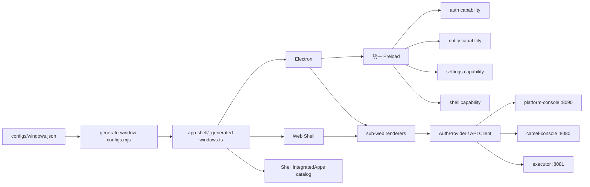

# Nebula Studio 前端架构现状与增量重构计划

> 文档版本：v2.0
>
> 最后更新：2026-07-26
>
> 代码基线：`F:\nebula-workspace\nebula-studio`
>
> 关联文档：[Nebula 当前状态分析](./nebula-current-state-analysis.md)、[Nebula 详细开发规划](./nebula-development-detailed-plan.md)

## 1. 文档目的

本文基于当前 `nebula-studio` 代码重新校准前端重构计划。旧版方案形成于
2026-06-25，其中多项“目标能力”已经落地，部分目录迁移建议也已失去必要性。

本次修订遵循以下原则：

1. 以当前代码为事实来源，不沿用旧路径和旧完成度。
2. 保留已经稳定的 `apps/sub-web/*` 结构，不进行纯命名型大迁移。
3. 优先消除真实重复源、契约漂移和运行时分叉。
4. 新增业务能力前先完成共享层和验收边界。
5. Web 与 Electron 必须复用同一份窗口、认证和 API 契约。

---

## 2. 当前架构基线

### 2.1 仓库结构

```text
nebula-studio/
├── apps/
│   ├── electron/                 # Electron 主进程和 renderer 构建入口
│   ├── electron-preload/src/     # 统一 Preload 实现
│   ├── web/                      # Web Shell
│   └── sub-web/
│       ├── frontend/             # Shell 主界面
│       ├── integration/          # 集成、插件、任务、治理、监控
│       ├── settings/             # 用户、组织、权限、配置
│       ├── login/                # 登录
│       └── docs/                 # UI/使用文档
├── configs/
│   ├── windows.json              # 窗口、Renderer、API 基址单源配置
│   └── windows.schema.json       # 配置 Schema
├── packages/
│   ├── contracts/                # 手写契约 + OpenAPI 生成结果
│   ├── core/
│   │   ├── api-client/
│   │   ├── app-shell/
│   │   ├── auth/
│   │   ├── auth-provider/
│   │   ├── electron-shared/
│   │   ├── msw/
│   │   ├── runtime/
│   │   ├── shell/
│   │   ├── sse-events/
│   │   └── tenant/
│   ├── ui/
│   ├── editors/
│   └── features/
│       └── use-confirm/
├── internal/vite/                # Vite+/Electron/Vite 配置封装
├── scripts/
│   ├── generate-window-configs.mjs
│   └── generate-contracts.mjs
└── e2e/                          # Playwright 冒烟与关键路径测试
```

### 2.2 当前运行模型



### 2.3 完成度矩阵

| 能力 | 当前状态 | 代码事实 | 结论 |
| --- | --- | --- | --- |
| 窗口配置集中化 | 基本完成 | `configs/windows.json` + JSON Schema + 生成脚本 | 保留并继续收口 |
| App Shell 分层 | 已完成 | `core/app-shell` 与 `core/shell` 已拆分 | 不再迁移目录 |
| 统一认证 | 已完成 | `auth-provider` 为 Session 单一写入入口 | 后续补跨应用一致性测试 |
| 统一 Preload | 已完成主体 | `electron-preload/src/unified.ts` + capability 工厂 | 仍有能力映射双源 |
| Web/Electron 配置复用 | 基本完成 | 两端均消费内部 Vite manifest/config | 继续删除手工入口映射 |
| API Client | 已完成基础层 | `core/api-client` 已有鉴权、响应解析和测试 | 需全面消费生成契约 |
| OpenAPI 生成 | 管道完成 | `contracts/generated/platform-api.ts` 已生成 | 业务代码采用率不足 |
| Integration 功能 | 功能较全但过载 | 插件、任务、服务治理、订阅、监控集中于单应用 | 需要按 feature 边界拆分 |
| Features 共享包 | 未按旧计划落地 | 当前仅 `use-confirm` 为正式 feature 包 | 按真实复用需求提取 |
| 编辑器边界 | 部分完成 | DAG/Flow 可用；`code-editor` 缺标准包入口 | 需要补齐导出和构建 |
| 插件前端 | 基本可用 | 插件分类、市场、Connector、DAG Node Schema 已接入 | 需适配新版 descriptor 契约 |
| E2E | 冒烟级 | 3 个 spec；关键流大量使用路由 Mock | 缺真实后端联调关口 |

---

## 3. 已完成事项

以下内容从后续重构范围中移除，避免重复建设。

### 3.1 配置与 Shell

- [x] 建立 `configs/windows.json` 和 `windows.schema.json`。
- [x] 生成 `packages/core/app-shell/src/common/_generated-windows.ts`。
- [x] Shell 集成目录从生成配置读取 label、icon、顺序和认证要求。
- [x] Web/Electron 构建统一使用 `@nebula-studio-internal/vite`。
- [x] API 基址和代理目标集中配置。

### 3.2 认证与运行时

- [x] 建立 `packages/core/auth-provider`。
- [x] Integration、Settings、Login 和 Shell 接入统一 Session API。
- [x] 建立 `packages/core/runtime` 的统一微应用启动入口。
- [x] 建立 Shell Event Bus 和租户共享能力。

### 3.3 Electron Preload

- [x] 合并为统一 Preload 实现。
- [x] auth、notify、settings、shell 拆分为 capability 工厂。
- [x] Electron Vite 构建按窗口生成虚拟 Preload 入口。
- [x] 不再为每个窗口维护完整且重复的 Preload 包。

### 3.4 前后端契约基础

- [x] 建立 SpringDoc → `openapi-typescript` 生成管道。
- [x] 保存离线 `openapi.json` 和 `platform-api.ts`。
- [x] API Client 支持 token、统一响应解析和未授权处理。
- [x] 插件页面已覆盖分类、市场和 Connector 能力。
- [x] DAG 编辑器可消费插件 Node Schema。

---

## 4. 当前主要问题

### F1. 窗口配置仍不是完全单源（P0）

`configs/windows.json` 已声明 `preloadCapabilities`，但
`apps/electron-preload/src/config.ts` 仍维护一份 `PRELOAD_CONFIG`。新增窗口时仍可能出现
窗口配置已生成、Preload 能力未同步的问题。

此外，生成脚本目前主要输出 `_generated-windows.ts`。Web Embed 入口文件仍以
`apps/web/src/embed/*-entry.ts` 形式存在，需要人工创建。

目标：

- Preload 能力直接从生成 manifest 获取。
- 删除手写 `PRELOAD_CONFIG`。
- 生成或校验 Web Embed 入口。
- `generate:configs` 后工作树必须无差异。

### F2. 生成契约未成为业务唯一类型源（P0）

`packages/contracts/generated/platform-api.ts` 已存在，但业务模块仍大量使用
`contracts/auth`、`contracts/system`、`contracts/integration` 下的手写 DTO。

风险：

- 后端字段变化不能在前端编译期完整暴露。
- 手写契约与 OpenAPI 同时演进。
- 插件 descriptor、生命周期状态和仓库 DTO 容易继续漂移。

目标：

1. 建立 generated type facade，禁止页面直接访问原始 OpenAPI 路径类型。
2. 按 Auth → Plugin → Integration → System 顺序迁移。
3. CI 执行 `generate:contracts` 后检查工作树差异。
4. 手写 DTO 仅保留 UI ViewModel，不重复服务端传输结构。

### F3. Integration 子应用职责过载（P1）

Integration 当前同时包含：

- 数据源和接口管理；
- 服务发布、审批、版本、授权和治理；
- 插件中心和插件市场；
- 任务调度；
- 订阅和 SSE；
- Executor 路由、日志、统计和拓扑；
- DAG/Flow 编排。

短期不建议立即拆成多个独立子应用。应先提取可测试、可复用的 feature 包，降低
Integration 内部耦合，再依据团队边界决定是否拆应用。

首批提取顺序：

1. `features/plugin-catalog`
2. `features/subscription-manager`
3. `features/service-release`
4. `features/version-diff`

提取条件：

- feature 不依赖 Integration Router。
- API、composable、mapper 和纯 UI 组件可独立测试。
- 页面壳和路由仍留在 Integration。

### F4. 插件 descriptor 前端模型需要同步（P1）

后端插件体系已完成以下调整：

- PF4J 引导信息由 JAR Manifest 提供。
- `nebula-plugin.json` 是插件身份和治理信息来源。
- `nebula-camel-plugin.json` 仅声明 Camel 领域能力。
- Camel descriptor 的 `pluginId`、`displayName` 等字段从平台 descriptor 继承。
- HTTP/MySQL/PostgreSQL 主插件类直接实现 Connector。

前端需要：

- 使用组合后的插件详情 DTO，不假设 Camel descriptor 自带身份字段。
- 展示平台兼容性、权限、capabilities 和领域 descriptor。
- 用 `configSchema` 生成 Connector 配置表单。
- 用 `nodeSchema` 驱动 DAG Node Palette 和属性面板。
- 区分插件安装状态、PF4J 运行状态和业务审批状态。

### F5. Code Editor 仍不是完整工作区包（P1）

`packages/editors/code-editor` 当前只有 Monaco Vue 文件和 README/tsconfig，缺少标准
`package.json`、公共 `index.ts`、类型导出及独立测试。

目标：

- 补齐 workspace package 契约。
- 从 `nebula-ui` 移出编辑器依赖。
- 明确 Monaco 与 CodeMirror 的使用边界。
- 编辑器包之间禁止相互依赖。

### F6. E2E 仍以 Mock 和页面可达性为主（P0）

现有 `critical-flow.spec.ts` 覆盖 Auth、Console、Executor、Gateway、SSE 和 Logout，
但请求由 Playwright route mock 返回；`studio-flow`、`g5-smoke` 主要验证页面可达。

真实验收至少需要：

1. 启动 `platform-console :8090`。
2. 启动 Camel Console/Executor `:8080/:8081`。
3. 启动 Web Shell。
4. 执行登录 → 租户 → 插件 → 订阅/SSE → Gateway → Monitor。
5. 保存失败时的 trace、截图和后端日志。

### F7. 文档与命名漂移（P2，已完成）

2026-07-26 已完成不涉及运行时代码的文档收口：

- [x] README 与架构注释统一描述基于 `unified.ts` 和 capability 的单一 Preload 架构。
- [x] 仓库文档统一使用当前 `apps/sub-web` 目录，不再规划迁移到 `apps/renderers`。
- [x] `electron-shared` 文档统一指向 `packages/core/electron-shared` 和当前
  `@nebula-studio-electron/electron-bridge` 导出。
- [x] 删除 Integration、Settings README 中的个人绝对路径。
- [x] 为 Docs 子应用补充 README，并加入 Monorepo 应用索引。

保留决策：暂不把 `apps/sub-web` 重命名为 `apps/renderers`。只有在构建工具、发布制品或团队
所有权明确受阻时才进行目录迁移。

---

## 5. 目标架构

目标不是再做一次目录大搬迁，而是在现有结构上形成稳定依赖方向。

```text
apps/*
  └─ 仅负责进程入口、路由和页面组合

packages/features/*
  └─ 负责可复用业务能力
      ├─ 可依赖 core/api-client、contracts、ui、editors
      └─ 不依赖 apps/*

packages/editors/*
  └─ 负责编辑器能力
      ├─ 可依赖 ui 基础包
      └─ 编辑器之间不互相依赖

packages/ui/*
  └─ 负责展示组件，不访问业务 API

packages/core/*
  └─ 负责认证、运行时、Shell、租户、API Client、SSE

packages/contracts/*
  └─ 负责服务端传输契约和生成类型 facade
```

强制依赖方向：

```text
apps → features → editors/ui → core/contracts
```

禁止：

- `core` 依赖 `features` 或 `apps`；
- `ui` 访问后端 API；
- feature 直接操作全局 Session Storage；
- 页面重新声明后端 DTO；
- Electron 与 Web 分别维护窗口或认证配置。

---

## 6. 分阶段实施计划

### Phase 1：单源配置与契约硬化（P0，1 个迭代）

- [ ] 从生成 manifest 构建 Preload capability map。
- [ ] 删除 `electron-preload/src/config.ts` 中的手写映射。
- [ ] 增加生成文件一致性检查。
- [ ] 建立 generated contracts facade。
- [ ] 迁移 Auth 和 Plugin API 类型。
- [ ] CI 增加配置、契约生成差异检查。

验收：

```powershell
vp run generate:configs
vp run generate:contracts
vp check
git diff --exit-code
```

### Phase 2：插件与 Integration 边界收敛（P1，1–2 个迭代）

- [ ] 新建 `features/plugin-catalog`。
- [ ] 统一平台 descriptor 与 Camel descriptor 的前端 ViewModel。
- [ ] Connector 配置表单消费 `configSchema`。
- [ ] DAG 节点消费 `nodeSchema`，删除重复静态映射。
- [ ] 提取 `subscription-manager`。
- [ ] 为 feature 增加 API/mapping/composable 单元测试。

验收：

- Integration 页面只负责路由和组合。
- 插件详情不依赖 Camel descriptor 中重复的身份字段。
- 内置 HTTP/MySQL/PostgreSQL 插件均能生成正确配置表单和 DAG 节点。

### Phase 3：编辑器和 UI 依赖治理（P1，1 个迭代）

- [ ] 补齐 `code-editor` package。
- [ ] 把 CodeMirror/Monaco/TipTap 等编辑器依赖移出基础 UI 包。
- [ ] 建立编辑器导出、类型检查、单测和 Bundle Budget。
- [ ] 检查循环依赖和跨层引用。

验收：

- `nebula-ui` 不再承担代码/富文本编辑器实现。
- 任一编辑器升级不会触发无关 feature 的强制改造。

### Phase 4：真实全链路验收（P0，1 个迭代）

- [ ] 保留 Mock E2E 作为快速回归。
- [ ] 新增 real-stack Playwright project。
- [ ] CI/本地脚本拉起 platform-console、Camel Console、Executor 和 Web。
- [ ] 覆盖登录、租户、插件、订阅、Gateway、Monitor。
- [ ] Electron 至少覆盖启动、认证恢复、Preload capability 和窗口切换。

验收：

- Mock E2E 与真实 E2E 分组运行。
- 真实后端字段变化能在 contract generation 或 E2E 中失败。
- 测试失败可定位到前端、Console 或 Executor。

---

## 7. 暂缓事项

以下事项不作为当前重构前置条件：

- 将 `apps/sub-web` 整体改名为 `apps/renderers`；
- 立即拆出 Tasks/Governance/Release/Plugins 四个独立应用；
- 一次性拆分全部 Integration 页面；
- 为目录美观合并 `electron-shared` 与其他 core 包；
- 在没有数据前承诺固定百分比的构建速度提升。

独立子应用拆分触发条件：

1. 有独立发布节奏；
2. 有明确团队所有权；
3. 需要独立权限或部署边界；
4. Integration 首屏和构建体积无法通过懒加载解决；
5. feature 已完成提取，不依赖 Integration 内部状态。

---

## 8. 质量关口

每个阶段必须满足：

- `vp check` 通过；
- 受影响 workspace 单测通过；
- `vp run build` 通过；
- 生成脚本执行后无未提交差异；
- 不新增手写服务端 DTO；
- 不新增窗口/Preload 双源配置；
- Web 与 Electron 共享同一能力定义；
- 新 API 有 MSW 或单元测试；
- 核心用户路径有 Playwright 覆盖；
- 文档与实际目录一致。

建议 CI：

```text
install
  → generate:configs
  → generate:contracts
  → generated-diff-check
  → vp check
  → unit tests
  → workspace build
  → mock e2e
  → real-stack e2e（合并或夜间关口）
```

---

## 9. 成功指标

| 指标 | 当前基线 | 目标 |
| --- | --- | --- |
| 窗口能力配置源 | JSON + Preload 手写映射 | 仅 `windows.json` |
| PF4J/Camel 插件身份解析 | 页面可能按单 descriptor 假设 | 使用组合 ViewModel |
| 生成契约业务采用率 | 较低 | 新增 API 100%，存量分批迁移 |
| 正式 feature 包 | 1 个 | 首批 3–4 个真实复用包 |
| Integration 职责 | 页面、API、mapper、feature 混合 | 页面组合与 feature 分离 |
| Code Editor | 非完整 workspace 包 | 可独立构建、测试、发布 |
| Playwright | 3 个冒烟 spec，主要 Mock | Mock 回归 + 真实全链路 |
| Preload 实现 | 已统一，配置仍有双源 | 实现和配置均单源 |

---

## 10. 风险与缓解

| 风险 | 影响 | 缓解 |
| --- | --- | --- |
| 删除 Preload 手写映射导致窗口能力缺失 | Electron API 不可用 | 生成期 Schema 校验 + capability 测试 |
| OpenAPI 类型直接泄漏到页面 | 页面类型复杂、迁移成本高 | generated facade + ViewModel mapper |
| 过早拆分 Integration | 路由、状态和交付节奏更复杂 | 先提取 feature，再决定拆应用 |
| 插件 descriptor 新旧格式并存 | 市场详情或 DAG 节点缺字段 | 后端组合 DTO + 前端兼容 mapper |
| 真实 E2E 环境不稳定 | CI 偶发失败 | Mock 快速关口 + real-stack 独立重试和日志 |
| 编辑器依赖拆分导致包体重复 | 构建产物增大 | manual chunks + bundle budget |

---

## 11. 近期执行顺序

1. 完成 F1：Preload capability 单源化。
2. 完成 F2：Auth/Plugin 生成契约迁移。
3. 完成 F4：插件组合 ViewModel 与 Schema 驱动 UI。
4. 提取 `plugin-catalog` 和 `subscription-manager`。
5. 补齐 `code-editor` 包。
6. 建立真实后端 Playwright 关口。

该顺序与后端当前重点一致：插件平台主链路和 Camel Connector 已完成结构收敛，前端应先
消费稳定 descriptor 与运行时契约，再扩展更多独立子应用。
